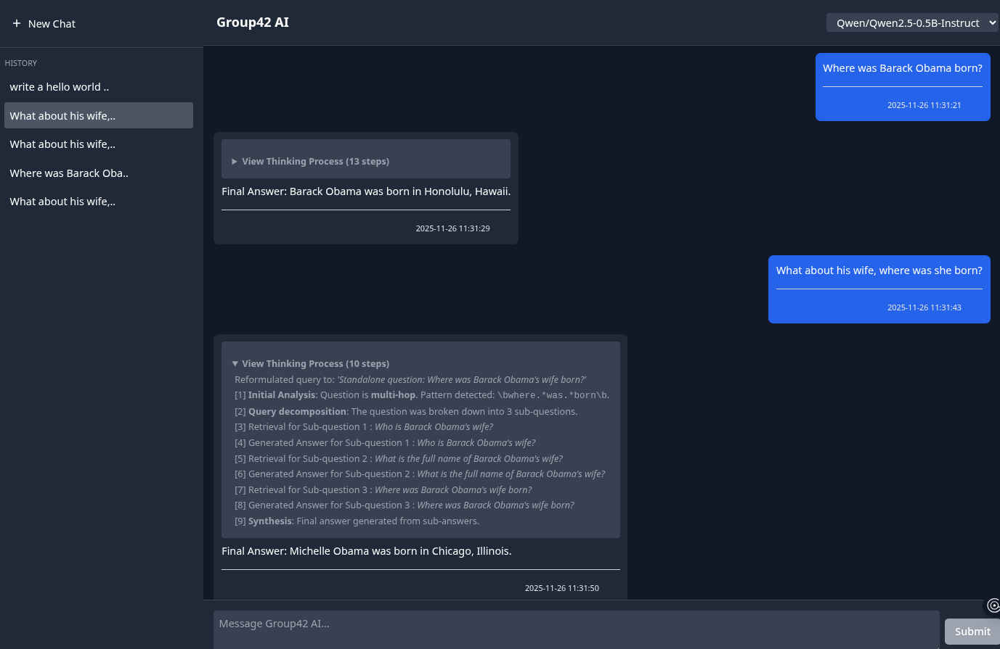

# PolyU-25Fall-COMP5423-RAG
> RAG Project for COMP5423 of PolyU 25Fall 

## Objective
This project aims to develop a **Retrieval-Augmented Generation (RAG)** system using a subset of the HotpotQA dataset, which contains multi-hop, Wikipedia-based questions along with their corresponding answers. The objective is to build an end-to-end question answering system capable of handling complex queries that require reasoning across multiple documents. By integrating a retrieval module with a generative large language model, the system will improve both the factual accuracy and explainability of answers through evidencegrounded response generation. The HotpotQA dataset will serve as the training and evaluation foundation, with a focus on understanding the application of RAG techniques to multi-hop, explainable question-answering tasks. The project will optimize both retrieval and generation components to enhance overall system performance for real-world RAG applications.

## Project Resource
In this project, we will develop and evaluate an RAG system based on a sampled subset of HotpotQA. The Train and Validation splits with relevant documents could be used in developing and self evaluation, while the Test split is for the final performanceevaluation by TAs. HQ-small is released at [https://huggingface.co/datasets/izhx/COMP5423-25Fall-HQ-small](https://huggingface.co/datasets/izhx/COMP5423-25Fall-HQ-small)



## Build & Start
To build a docker image, copy `.env.example` to `.env` and configure it with your preferences.

Applicable environments in `.env` are like:
```bash
RAG42_FRONTEND_PORT=3000
RAG42_BACKEND_PORT=5000
RAG42_BACKEND_HOST=0.0.0.0
RAG42_STORAGE_DIR=./volumes/storage
RAG42_CACHE_DIR=./cache
RAG42_OPENAI_API_KEY=sk_xxxxxxxxxxxxxxxxxxxxxxxxxxxxx
RAG42_OPENAI_API_URL=https://dashscope.aliyuncs.com/compatible-mode/v1
```

Start to build images and to run:
```bash
source .env && sh build.sh
sh start.sh
```
