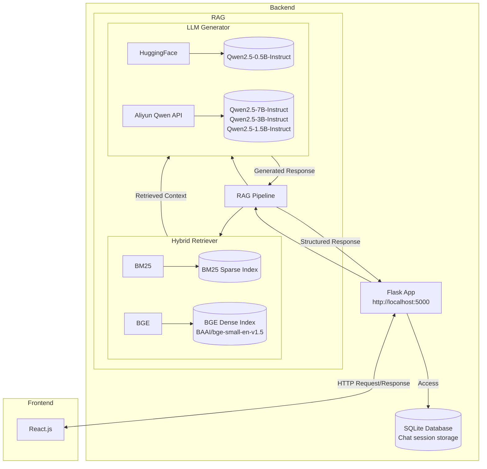

```mermaid
graph TD
    subgraph Backend
        C[Flask App <br/> http://localhost:5000]
        F[(SQLite Database <br/> Chat session storage)]
        subgraph RAG [RAG]
            E[RAG Pipeline]
            subgraph G[Hybrid Retriever]
                BM25 --> BM25Index[(BM25 Sparse Index)]
                BGE --> BGEIndex[(BGE Dense Index<br/>BAAI/bge-small-en-v1.5)]
            end
            subgraph H[LLM Generator]
                HF[HuggingFace] --> LocalModel[(Qwen2.5-0.5B-Instruct)]
                OI[Aliyun Qwen API] --> AliyunAPI[( Qwen2.5-7B-Instruct<br/> Qwen2.5-3B-Instruct </br>  Qwen2.5-1.5B-Instruct)]
            end
        end
    end
    subgraph Frontend
        B[React.js]
    end
    C -->|Access| F
    C --> E
    E --> G
    E --> H
    G -->|Retrieved Context| H
    H -->|Generated Response| E
    E -->|Structured Response| C
    C <-->|HTTP Request/Response| B
```