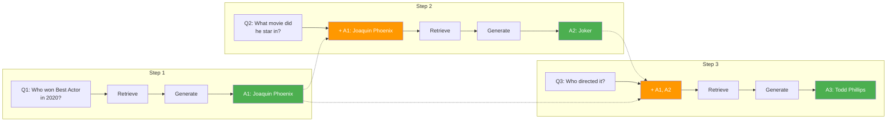

# Chain-of-Thought Reasoning

**Chain-of-thought reasoning** is the technique of passing answers from previous sub-questions as context to later ones. This allows each step to build on the knowledge gained from earlier steps, creating a reasoning chain.

:::tip What you will learn
- What chain reasoning is and why it matters
- How prior sub-answers are injected into prompts
- The `prior_context` prompt construction
- The complete reasoning loop in the agentic workflow
- Benefits and limitations of chain reasoning
:::

## The Core Idea

In a multi-hop question, the answer to sub-question 2 often depends on the answer to sub-question 1. Without chain reasoning, each sub-question is answered in isolation, and the LLM has to guess what the earlier answer was.

**Without chain reasoning:**

```
Q1: Who won Best Actor in 2020?          -> A1: Joaquin Phoenix
Q2: What movie did [???] star in?         -> A2: ??? (LLM does not know who)
Q3: Who directed [???]?                   -> A3: ??? (LLM does not know which movie)
```

**With chain reasoning:**

```
Q1: Who won Best Actor in 2020?                    -> A1: Joaquin Phoenix
Q2: What movie did Joaquin Phoenix star in?         -> A2: Joker
     (A1 is passed as prior context)
Q3: Who directed Joker?                             -> A3: Todd Phillips
     (A1 and A2 are passed as prior context)
```

## How Prior Context is Built

When answering each sub-question, RAG42 collects all previous sub-answers and formats them as context:

```python title="agentic_workflow.py -- answer_from_docs"
prior_context = ""
if prior_answers:
    prior_context = "Previous sub-answers:\n" + "\n".join(
        [f"- {ans}" for ans in prior_answers]
    ) + "\n\nUse these answers if they help answer the current question.\n\n"

prompt = (
    "Answer the question using ONLY the information in the evidence below. "
    "Your answer must be a short phrase, a single entity name, or 'yes'/'no'. "
    "Do NOT write a full sentence. Do NOT add explanations.\n\n"

    f"{prior_context}"
    "Evidence:\n"
    f"{evidence_snippets}\n\n"

    f"Question: {query}\n\n"

    "Answer:"
)
```

The `prior_context` block looks like this in the actual prompt:

```
Previous sub-answers:
- Joaquin Phoenix
- Joker

Use these answers if they help answer the current question.

Evidence:
[1] Joker is a 2019 American psychological thriller film directed by Todd Phillips...
[2] ...

Question: Who directed Joker?

Answer:
```

:::info "Use these answers if they help"
This instruction is deliberately soft. It tells the LLM the prior answers are available, but does not force it to use them. If the evidence alone is sufficient, the LLM can ignore the prior answers. This avoids injecting incorrect information when the prior answers happen to be wrong.
:::

## The Reasoning Loop

Here is the complete chain reasoning loop from `agentic_workflow.py`:

```python title="agentic_workflow.py -- chain reasoning loop"
sub_answers = []
for i, sub_q in enumerate(sub_questions):
    # Retrieve relevant documents for the sub-question
    retrieved_docs = self.retriever.retrieve(sub_q, k=10)

    # Extract document texts (tuples are (id, text, score))
    doc_texts = [doc_text for (_, doc_text, _) in retrieved_docs]

    # Generate answer WITH prior sub-answers as context
    sub_answer = self.answer_from_docs(
        sub_q, doc_texts, prior_answers=sub_answers[:i]
    )
    sub_answers.append(sub_answer)
```

The key line is `prior_answers=sub_answers[:i]`. This passes only the answers from sub-questions 0 through i-1 (all previous answers, but not the current one). This means:

- Sub-question 0 gets **no prior context** (it is the first)
- Sub-question 1 gets **A0** as context
- Sub-question 2 gets **A0, A1** as context
- Sub-question 3 gets **A0, A1, A2** as context
- And so on...

## Visual: The Chain

Here is how the chain builds step by step:



## A Concrete Example

Let us trace the actual prompts for a three-hop question.

### Sub-question 0: "Who won Best Actor in 2020?"

```
Previous sub-answers:
(none -- this is the first sub-question)

Evidence:
[1] The 92nd Academy Awards ceremony took place on February 9, 2020...
[2] Joaquin Phoenix won Best Actor for his role in Joker...

Question: Who won Best Actor in 2020?

Answer:
```

**Output:** Joaquin Phoenix

### Sub-question 1: "What movie did Joaquin Phoenix star in?"

```
Previous sub-answers:
- Joaquin Phoenix

Use these answers if they help answer the current question.

Evidence:
[1] Joker is a 2019 American psychological thriller film directed and
produced by Todd Phillips, who co-wrote the screenplay with Scott Silver.
The film stars Joaquin Phoenix as the Joker...

Question: What movie did Joaquin Phoenix star in?

Answer:
```

**Output:** Joker

### Sub-question 2: "Who directed Joker?"

```
Previous sub-answers:
- Joaquin Phoenix
- Joker

Use these answers if they help answer the current question.

Evidence:
[1] Joker is a 2019 American psychological thriller film directed and
produced by Todd Phillips...

Question: Who directed Joker?

Answer:
```

**Output:** Todd Phillips

:::note Each step adds knowledge
Notice how the prior context grows with each step. By the time we reach sub-question 2, the LLM knows both the actor (Joaquin Phoenix) and the movie (Joker), making it easy to extract the director from the evidence.
:::

## Benefits of Chain Reasoning

1. **Resolves ambiguity** -- when a sub-question has multiple possible answers, prior context narrows it down
2. **Enables entity grounding** -- pronouns and vague references ("he", "that movie") can be resolved using prior answers
3. **Improves retrieval indirectly** -- decomposed sub-questions with concrete entities retrieve better documents
4. **Makes reasoning transparent** -- the chain of sub-answers is visible in the thinking process, making debugging easier

## Limitations

1. **Error propagation** -- if an early sub-answer is wrong, it poisons all downstream answers (see [Answer Verification](./verification.md) for mitigation)
2. **Increased latency** -- each sub-question requires a separate retrieval and generation call
3. **Token budget pressure** -- prior context takes up space in the prompt, leaving less room for evidence
4. **Not always needed** -- for simple questions, chain reasoning adds overhead without benefit (this is why the workflow falls back to single-hop when decomposition yields fewer than 2 sub-questions)
