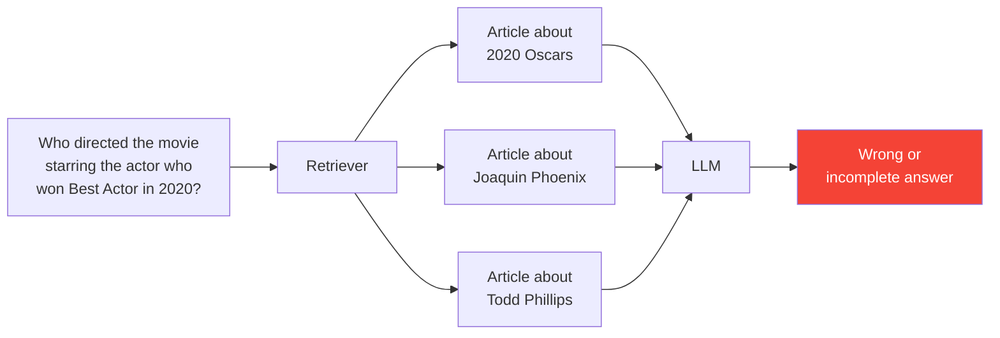
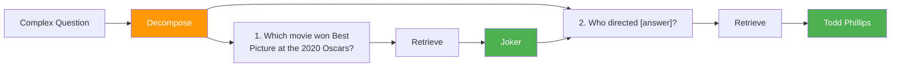
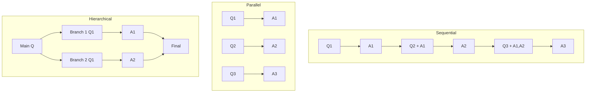

# Query Decomposition

**Query decomposition** is the process of breaking a complex question into simpler, answerable sub-questions. This is the first and most critical step in the agentic workflow -- if decomposition is wrong, every subsequent step inherits that error.

:::tip What you will learn
- Why decomposition is necessary for multi-hop questions
- The few-shot decomposition prompt
- How the LLM output is parsed into sub-questions
- Sequential vs parallel vs hierarchical decomposition strategies
- Error propagation concerns
- A worked example from start to finish
:::

## The Problem: Without Decomposition

Consider this question:

> "Who was the director of the movie starring the actor who won Best Actor in 2020?"

Without decomposition, the retriever searches for this entire complex question as a single query. The problem:

- No single Wikipedia article answers the full chain
- The retriever may find articles about the 2020 Oscars, or about Joaquin Phoenix, or about Joker, but rarely all three in the right relationship
- The LLM receives a jumble of partially relevant documents and guesses



## The Solution: With Decomposition

With decomposition, the question is split into a chain of simpler questions, each targeting a single fact:



Each sub-question is simple enough to retrieve precise documents for, and the LLM only needs to extract one fact at a time.

## The Decomposition Prompt

RAG42 uses **few-shot prompting** to teach the LLM how to decompose questions. The prompt includes one example, then asks the LLM to decompose the actual question:

```python title="agentic_workflow.py -- decompose_query"
few_shot = (
    "Example:\n"
    "Complex Question: Who was the director of the movie that won Best Picture "
    "at the 2020 Oscars?\n"
    "Sub-questions:\n"
    "1. Which movie won Best Picture at the 2020 Oscars?\n"
    "2. Who directed [answer from 1]?\n\n"
)

decomposition_prompt = (
    "You are an expert at breaking down complex questions. Decompose the "
    "following question into a sequence of simple, answerable sub-questions. "
    "Each sub-question must build logically on the previous one and use "
    "concrete entities. Do NOT answer -- just list sub-questions.\n\n"

    f"{few_shot}"
    f"Complex Question: {question}\n"
    "Sub-questions:\n"
    "1."
)
```

Key design choices:

- **One few-shot example** teaches the format without wasting too many tokens
- **"Do NOT answer"** prevents the LLM from trying to answer instead of decomposing
- **"build logically on the previous one"** ensures sub-questions form a chain
- **"use concrete entities"** discourages vague sub-questions
- **"1."** at the end primes the LLM to start the numbered list

## Parsing the Output

The LLM returns a free-text response. RAG42 parses it with two strategies:

### Strategy 1: Numbered Lists

The primary format. Matches lines like `"1. Which movie won..."`:

```python
numbered_match = re.match(r'^\d+\.\s*(.+)', line)
if numbered_match:
    sub_q = numbered_match.group(1).strip()
    sub_questions.append(sub_q)
```

### Strategy 2: "Sub-question N:" Format

A fallback for models that use a different format. Matches lines like `"Sub-question 1: Which movie won..."`:

```python
elif ':' in line and ('sub-question' in line.lower() or 'sub question' in line.lower()):
    match = re.match(r'^.*?:\s*(.+)', line.strip(), re.IGNORECASE)
    if match:
        sub_q = match.group(1).strip()
        sub_questions.append(sub_q)
```

After parsing, the list is cleaned:

```python
# Remove empty strings and limit to max steps
sub_questions = [sq for sq in sub_questions if sq.strip()][:self.MAX_DECOMPOSITION_STEPS]
```

:::note MAX_DECOMPOSITION_STEPS = 10
The maximum number of sub-questions is capped at 10 to prevent runaway decomposition. In practice, HotpotQA questions typically decompose into 2-3 sub-questions.
:::

## Decomposition Strategies

There are three common decomposition strategies. RAG42 uses **sequential** decomposition.

### Sequential Decomposition (Used by RAG42)

Each sub-question depends on the answer to the previous one. This creates a chain of reasoning.

```
Q1: Which movie won Best Picture at the 2020 Oscars?
  -> A1: Joker
Q2: Who directed Joker?
  -> A2: Todd Phillips
```

**Pros:** Simple, each step is well-defined.
**Cons:** Errors in early steps propagate to later ones.

### Parallel Decomposition

All sub-questions are independent and can be answered simultaneously.

```
Q1: Who starred in Movie A?
Q2: Who directed Movie A?
Q3: What year was Movie A released?
```

**Pros:** Faster (can run in parallel).
**Cons:** Does not work for questions where sub-questions depend on each other.

### Hierarchical Decomposition

A tree structure where higher-level questions are broken into independent branches.

```
Q: Compare the directors of Movie A and Movie B
  -> Q1: Who directed Movie A?
  -> Q2: Who directed Movie B?
    -> Final: Compare the two directors
```

**Pros:** Handles comparison questions well.
**Cons:** More complex to implement.



## Error Propagation

The biggest risk in sequential decomposition is **error propagation**: if the LLM makes a mistake in an early sub-answer, every subsequent step is built on wrong information.

For example:

```
Q1: Which movie won Best Picture at the 2020 Oscars?
  -> A1 (WRONG): 1917    (actually Joker won)
Q2: Who directed 1917?
  -> A2: Sam Mendes      (correct for 1917, but wrong for the original question)
```

RAG42 mitigates this through:

1. **Answer verification** -- each answer is checked against evidence
2. **Few-shot examples** -- the decomposition prompt teaches the correct format
3. **Retrieving for the original question too** -- not just sub-questions

```python title="agentic_workflow.py -- retrieval strategy"
# Retrieve for the original question AND sub-questions
original_retrieved = self.retriever.retrieve(question, k=10)

for i, sub_q in enumerate(sub_questions):
    retrieved_docs = self.retriever.retrieve(sub_q, k=10)
```

:::info Why retrieve for the original question too?
Some supporting documents are only found by searching the full question, not the decomposed sub-questions. By retrieving for both, RAG42 casts a wider net and reduces the chance of missing critical evidence.
:::

## Worked Example

Let us trace the full decomposition process for a real question.

**Input question:** "Who was the director of the movie starring the actor who won Best Actor in 2020?"

### Step 1: Decompose

The LLM receives the decomposition prompt and produces:

```
1. Who won Best Actor in 2020?
2. What movie did [answer from 1] star in?
3. Who directed [answer from 2]?
```

### Step 2: Parse

The parser extracts three sub-questions:

```python
sub_questions = [
    "Who won Best Actor in 2020?",
    "What movie did Joaquin Phoenix star in?",
    "Who directed Joker?",
]
```

Note: The LLM sometimes fills in `[answer from 1]` with a concrete entity. This is actually helpful because it makes retrieval more precise.

### Step 3: Retrieve and Answer Each

| Sub-question | Retrieved Docs | Answer |
|-------------|----------------|--------|
| Q1: Who won Best Actor in 2020? | Articles about 92nd Academy Awards | Joaquin Phoenix |
| Q2: What movie did Joaquin Phoenix star in? | Articles about Joaquin Phoenix, Joker (2019 film) | Joker |
| Q3: Who directed Joker? | Articles about Joker (2019 film) | Todd Phillips |

### Step 4: Synthesize

The synthesis prompt combines the sub-answers:

```
Original Question: Who was the director of the movie starring the actor
who won Best Actor in 2020?

Sub-answers:
Sub-answer 1: Joaquin Phoenix
Sub-answer 2: Joker
Sub-answer 3: Todd Phillips

Final Answer: Todd Phillips
```

:::tip Key insight
Each sub-question targets a single fact that can be found in one or two documents. The chain of answers builds up the reasoning path from the award to the actor to the movie to the director.
:::
