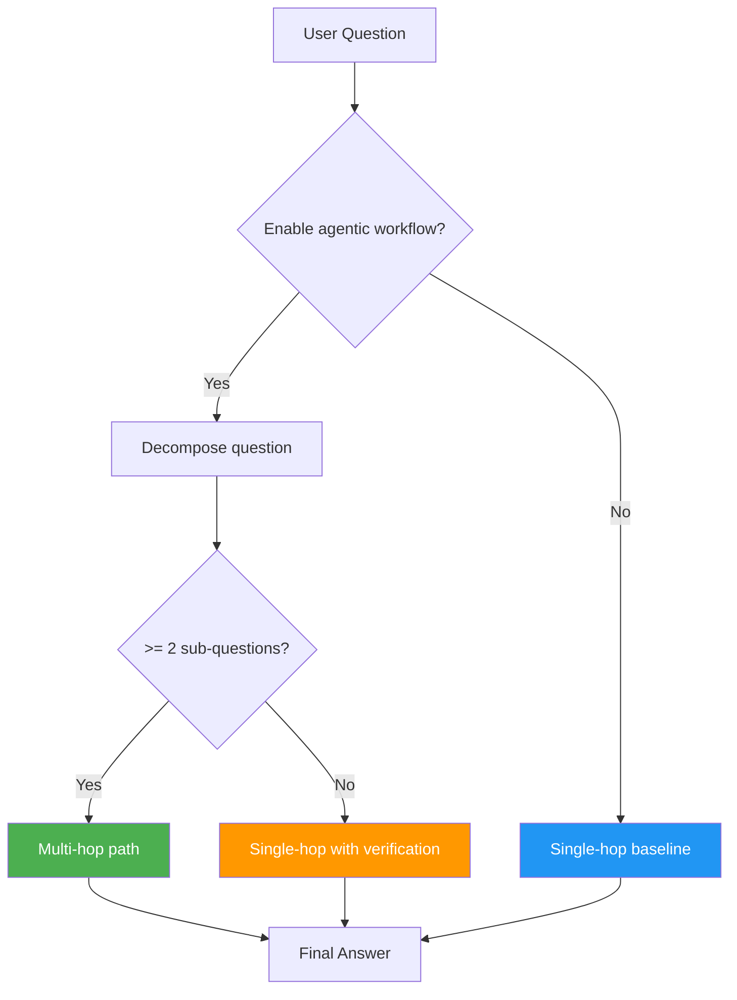

# Agentic Workflow Overview

The **agentic workflow** is the brain of RAG42. It orchestrates how questions are decomposed, retrieved, reasoned over, and synthesized into answers. This page explains why a simple retrieve-then-generate approach is not enough and how the agentic workflow solves the problem.

:::tip What you will learn
- What "agentic" means in the context of RAG42
- Why simple retrieve-then-generate fails for multi-hop questions
- The full RAG42 pipeline flow
- When to use the agentic workflow vs the simple single-hop workflow
:::

## What Does "Agentic" Mean Here?

In AI, an **agent** is a system that can plan, make decisions, and take multiple steps to achieve a goal. In RAG42, the agentic workflow is "agentic" because it does not just blindly retrieve and generate. Instead, it:

1. **Analyzes** the question to decide if it needs decomposition
2. **Plans** by breaking complex questions into sub-questions
3. **Executes** retrieval and generation for each sub-question
4. **Chains** reasoning so each step builds on the previous ones
5. **Verifies** the answer and retries if it is unsupported by evidence

This is fundamentally different from a simple "retrieve once, generate once" approach.

## The Problem: Why Single-Hop Fails

Consider this multi-hop question:

> "Who was the director of the movie starring the actor who won Best Actor in 2020?"

A simple retrieve-then-generate pipeline would:

1. Take the full question as a single search query
2. Retrieve the top-K documents
3. Ask the LLM to answer from those documents

This often fails because:

- **No single document** contains the complete answer chain
- The retriever cannot find documents that bridge all three entities (award, actor, director)
- The LLM gets confused by incomplete or mixed evidence

:::warning The single-hop limitation
The single-hop workflow (`SingleHopWorkflow`) exists in RAG42 only as a **baseline for evaluation**. It is simpler but significantly less accurate on multi-hop questions from HotpotQA.
:::

## The RAG42 Pipeline Flow

Here is the full interactive pipeline. Click **Run Pipeline** to see each step animate in sequence:

import RAGFlowDiagram from '@site/src/components/RAGFlowDiagram';

<RAGFlowDiagram />

The pipeline has 8 steps:

1. **User Query** -- the user asks a question through the web interface
2. **Query Reformulation** -- (multi-turn only) resolve coreferences like "he", "it" using chat history
3. **Query Decomposition** -- the LLM breaks complex questions into simpler sub-questions
4. **Hybrid Retrieval** -- BM25 (keyword) + BGE (semantic) retrieve candidates, fused with RRF
5. **Cross-Encoder Re-ranking** -- a cross-encoder re-scores top candidates for precision
6. **LLM Generation** -- the LLM generates answers using retrieved evidence as context
7. **Answer Synthesis** -- sub-answers are combined into a final concise answer
8. **Final Answer** -- clean, post-processed answer returned to the user

## Agentic vs Single-Hop: Comparison

| Feature | SingleHopWorkflow | AgenticWorkflow |
|---------|-------------------|-----------------|
| **Question analysis** | None | Decomposes into sub-questions |
| **Retrieval** | One round for the full question | One round per sub-question + original |
| **Reasoning** | Direct answer from evidence | Chain reasoning across sub-answers |
| **Verification** | None | Verifies answer against evidence, retries if needed |
| **Multi-turn support** | No | Yes (query reformulation) |
| **Best for** | Simple, single-fact questions | Complex, multi-hop questions |
| **Accuracy on HotpotQA** | Lower | Significantly higher |
| **Latency** | Faster (fewer LLM calls) | Slower (multiple LLM calls) |

## The Agentic Workflow `run()` Method

Here is the high-level logic of the agentic workflow's main method:

```python title="agentic_workflow.py -- run (simplified)"
def run(self, question: str) -> Tuple[str, List[Dict[str, Any]]]:
    # Step 1: Reformulate query if multi-turn
    if self.need_reformulate:
        question = self.reformulate_query(question, self.session_history)

    # Step 2: Attempt decomposition
    sub_questions = self.decompose_query(question)
    is_multi_hop = len(sub_questions) >= 2

    if is_multi_hop:
        # Step 3a: Multi-hop path
        original_retrieved = self.retriever.retrieve(question, k=10)

        sub_answers = []
        for i, sub_q in enumerate(sub_questions):
            retrieved_docs = self.retriever.retrieve(sub_q, k=10)
            sub_answer = self.answer_from_docs(
                sub_q, doc_texts, prior_answers=sub_answers[:i]
            )
            sub_answers.append(sub_answer)

        # Step 4a: Synthesize final answer
        final_answer = self.synthesize_answer(question, sub_answers)

    else:
        # Step 3b: Single-hop fallback
        retrieved_docs = self.retriever.retrieve(question, k=10)
        final_answer = self.answer_with_verification(question, doc_texts)

    return final_answer, steps_log
```

:::info Automatic fallback
If decomposition produces fewer than 2 sub-questions, the agentic workflow automatically falls back to the single-hop path (with verification). This means it degrades gracefully on simple questions.
:::

## When to Use Each Workflow



**Use AgenticWorkflow when:**
- You are answering HotpotQA or similar multi-hop datasets
- Accuracy is more important than speed
- You want answer verification and retry logic
- You need multi-turn conversation support

**Use SingleHopWorkflow when:**
- You are evaluating a baseline for comparison
- Speed is critical and questions are simple
- You want fewer LLM calls and lower cost

## Next Steps

- [Query Decomposition](./decomposition.md) -- how complex questions are broken into sub-questions
- [Chain-of-Thought Reasoning](./chain-reasoning.md) -- how sub-answers are chained together
- [Answer Verification](./verification.md) -- how answers are verified and retried
- [Multi-Turn Conversations](./multi-turn.md) -- how follow-up questions are handled
