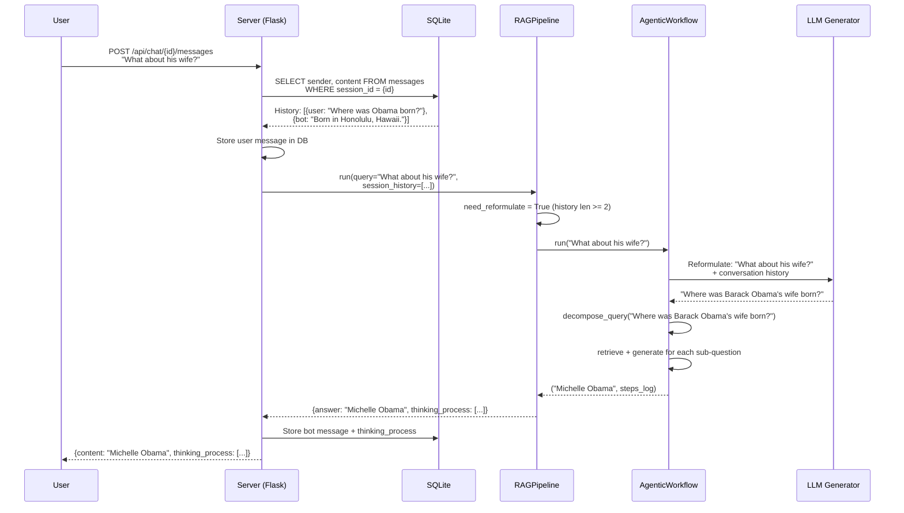
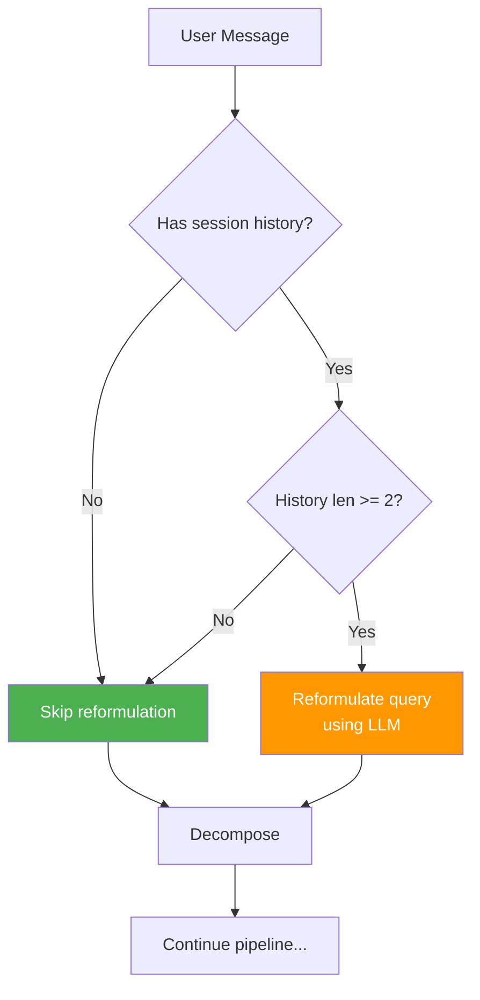

# Multi-Turn Conversations

**Multi-turn conversations** allow users to ask follow-up questions that reference previous answers. RAG42 handles this through **query reformulation** -- resolving pronouns and references using conversation history before running the RAG pipeline.

:::tip What you will learn
- What multi-turn means and why it is challenging
- Coreference resolution with a concrete example
- The query reformulation prompt
- How session history is collected from SQLite
- The `need_reformulate` logic
- The complete multi-turn flow
:::

## The Problem: Follow-Up Questions

In a real conversation, users rarely ask self-contained questions. They ask follow-ups:

```
User: Where was Barack Obama born?
Bot:  Barack Obama was born in Honolulu, Hawaii.
User: What about his wife?           <-- "his" = Barack Obama
```

The follow-up question "What about his wife?" is ambiguous on its own. Without context, the retriever would search for generic documents about "his wife" and find nothing useful. The system needs to understand that "his" refers to "Barack Obama" and reformulate the query to:

> "Where was Barack Obama's wife born?"

This process is called **coreference resolution** -- replacing pronouns and references with the entities they refer to.

:::info Coreference resolution
Coreference resolution is a natural language processing task that identifies all expressions in a text that refer to the same entity. In RAG42, this is done by the LLM, not by a dedicated NLP model.
:::

## The Query Reformulation Prompt

RAG42 uses the LLM to reformulate follow-up queries into standalone questions:

```python title="agentic_workflow.py -- reformulate_query"
reformulation_prompt = (
    "You are a precise query rewriting assistant. Your ONLY task is to rewrite "
    "the final user query as a standalone question by resolving coreferences "
    "(e.g., 'he', 'his', 'it') using the conversation history. "
    "Do NOT change the user's intent, add information, or answer the question. "
    "Return ONLY the rewritten question -- no prefix, no explanation.\n\n"

    "Conversation History:\n"
    f"{conversation_text}\n\n"

    "Final User Query:\n"
    f"{query}\n\n"

    "Standalone Question:"
)
```

The prompt includes:

1. **Role instruction** -- "You are a precise query rewriting assistant"
2. **Task constraint** -- only resolve coreferences, do not change intent or answer
3. **Conversation history** -- formatted as a dialogue transcript
4. **The follow-up query** -- the current user message
5. **Output cue** -- "Standalone Question:" to trigger the LLM's response

### Conversation History Format

The history is formatted as a dialogue transcript:

```python title="agentic_workflow.py -- build conversation transcript"
conversation_lines = []
for turn in history:
    role = "User" if turn["sender"] == "user" else "Assistant"
    conversation_lines.append(f"{role}: {turn['content']}")
conversation_text = "\n".join(conversation_lines)
```

This produces:

```
User: Where was Barack Obama born?
Assistant: Barack Obama was born in Honolulu, Hawaii.
```

### Example Reformulation

Given the history above and the follow-up "What about his wife?", the LLM produces:

```
Standalone Question: Where was Barack Obama's wife born?
```

The pronoun "his" has been resolved to "Barack Obama" and "What about" has been expanded to a complete question.

:::warning Fallback behavior
If the reformulated query is empty or shorter than 3 characters, the system falls back to the original query. This prevents the pipeline from breaking on malformed LLM output.
:::

## How Session History is Collected

Session history is stored in a **SQLite database** and collected before each request:

```python title="server.py -- collecting history"
# 1. Collect history dialogues for Multi-turn
history_dialogues = conn.execute('''
    SELECT sender, content
    FROM messages
    WHERE session_id = ?
    ORDER BY timestamp ASC
''', (chat_id,)).fetchall()
history_dialogues = [dict(msg) for msg in history_dialogues]
```

Each message in the history has two fields:

| Field | Type | Values |
|-------|------|--------|
| `sender` | string | `"user"` or `"bot"` |
| `content` | string | The message text |

The history is passed to the RAG pipeline along with the current query:

```python title="server.py -- passing history to pipeline"
rag_result = rag_pipeline.run(
    query=user_message,
    session_history=history_dialogues,
    model_name=model_name
)
```

## The `need_reformulate` Logic

Not every query needs reformulation. RAG42 decides based on the length of the session history:

```python title="rag_pipeline.py -- reformulation decision"
need_reformulate = False
if session_history:
    if len(session_history) < 2:
        logger.debug("Session history too short; using original query.")
    else:
        logger.debug("Reformulating query based on session history...")
        need_reformulate = True
```

The logic is:

| Session History Length | `need_reformulate` | Reason |
|----------------------|-------------------|--------|
| 0 (no history) | `False` | Nothing to resolve |
| 1 (first exchange) | `False` | Only one turn, no follow-up yet |
| 2 or more | `True` | Enough context for coreference resolution |

:::note Why `len >= 2`?
With only 1 message in history, the current query is the second message in the conversation. At this point, there is typically no pronoun to resolve -- the user's first follow-up is usually self-contained. By the third message (history length 2), pronouns like "he", "it", "the same" become common.
:::

## The Multi-Turn Flow

Here is the complete sequence of events when a user sends a follow-up question:



### Step-by-Step Breakdown

1. **User sends follow-up** -- "What about his wife?"
2. **Server collects history** -- queries SQLite for all messages in this chat session
3. **Server stores user message** -- inserts the new message into the database
4. **Pipeline checks history length** -- `len(session_history) >= 2`, so `need_reformulate = True`
5. **AgenticWorkflow reformulates** -- uses the LLM to resolve "his wife" to "Barack Obama's wife"
6. **Decomposition** -- the reformulated question is decomposed into sub-questions
7. **Retrieval and generation** -- each sub-question is answered with chain reasoning
8. **Synthesis** -- sub-answers are combined into a final answer
9. **Server stores bot response** -- the answer and thinking process are saved to the database
10. **Response returned** -- the user sees the answer and can click through the thinking steps

## Multiple Follow-Ups

The system handles chains of follow-ups naturally. Each new query includes the full history:

```
Turn 1: "Where was Barack Obama born?"
  -> History: []
  -> need_reformulate: False
  -> Answer: Honolulu, Hawaii

Turn 2: "What about his wife?"
  -> History: [Turn 1]
  -> need_reformulate: True (len >= 2)
  -> Reformulated: "Where was Barack Obama's wife born?"
  -> Answer: Chicago, Illinois

Turn 3: "And when was she born?"
  -> History: [Turn 1, Turn 2]
  -> need_reformulate: True
  -> Reformulated: "When was Michelle Obama born?"
  -> Answer: January 17, 1964
```

:::tip History grows with each turn
The full conversation history is collected from the database on every request. This means the LLM has access to the entire conversation, not just the last two turns. This helps resolve references that span multiple turns (e.g., "the person we discussed earlier").
:::

## Limitations

1. **Latency** -- reformulation adds one extra LLM call before the main pipeline runs
2. **Hallucinated context** -- the LLM might incorrectly resolve a pronoun if the conversation history is ambiguous
3. **No topic detection** -- the system does not detect topic changes. If the user suddenly switches topics, the reformulation might incorrectly inject context from the old topic
4. **History length** -- very long conversations may exceed the LLM's context window when formatting the history

## Where Multi-Turn Fits in the Pipeline



The reformulation step runs **before** decomposition. This means the decomposed sub-questions are based on the reformulated (standalone) query, not the ambiguous follow-up.
