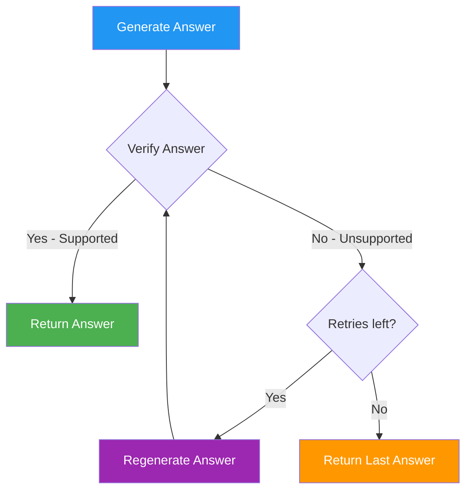

# Answer Verification

**Answer verification** is a quality control step in RAG42 that checks whether a generated answer is actually supported by the retrieved evidence. If the answer is unsupported, the system regenerates it.

:::tip What you will learn
- What answer verification does and why it is needed
- The verification prompt and how it works
- The generate-verify-retry flow
- How `max_retries` controls the retry loop
- When verification helps and when it is unnecessary
:::

## The Problem: Unfaithful Answers

LLMs sometimes generate answers that sound plausible but are not supported by the evidence. This can happen because:

- The LLM's parametric knowledge conflicts with the evidence
- The evidence is ambiguous and the LLM guesses wrong
- The LLM hallucinates a fact that is not in any document

For example, given evidence about the movie Joker, an LLM might incorrectly answer "Martin Scorsese" as the director (because Scorsese was initially attached to the project), even though the evidence clearly states "Todd Phillips."

:::warning The hallucination problem
Verification does not eliminate hallucinations -- it reduces them. A small model (like 0.5B) may still produce incorrect answers even after verification. The verification step is a best-effort safety net, not a guarantee.
:::

## The Verification Prompt

The verification prompt asks the LLM to judge whether an answer is supported by the evidence:

```python title="agentic_workflow.py -- verify_answer"
verify_prompt = (
    "Verify whether the following answer is directly supported by the evidence.\n\n"
    f"Question: {question}\n"
    f"Answer: {answer}\n\n"
    f"Evidence:\n{evidence[:3000]}\n\n"
    "Is the answer supported by the evidence? Respond with ONLY 'yes' or 'no'."
)
```

The prompt is structured as:

| Section | Content |
|---------|---------|
| Instruction | "Verify whether the following answer is directly supported by the evidence." |
| Question + Answer | The original question and the generated answer |
| Evidence | Retrieved documents, truncated to 3000 characters |
| Output constraint | "Respond with ONLY 'yes' or 'no'" |

The LLM reads the evidence and the answer, then outputs "yes" if the answer is grounded in the evidence, or "no" if it is not.

## The Verify-Answer Method

```python title="agentic_workflow.py -- verify_answer"
def verify_answer(self, question: str, answer: str, evidence: str) -> str:
    verify_prompt = (
        "Verify whether the following answer is directly supported by the evidence.\n\n"
        f"Question: {question}\n"
        f"Answer: {answer}\n\n"
        f"Evidence:\n{evidence[:3000]}\n\n"
        "Is the answer supported by the evidence? Respond with ONLY 'yes' or 'no'."
    )
    try:
        response = self.generator.generate(verify_prompt).strip().lower()
        if 'yes' in response:
            return answer       # Answer is verified
        else:
            return ""           # Answer failed verification
    except Exception as e:
        logger.warning(f"Answer verification error: {e}. Keeping original answer.")
        return answer           # On error, keep the original answer
```

The method returns:
- The original `answer` string if verification passes (the LLM said "yes")
- An empty string `""` if verification fails (the LLM said "no")
- The original `answer` if the verification itself throws an error (fail-open)

:::info Fail-open design
If the verification LLM call fails (network error, timeout, etc.), the system keeps the original answer rather than discarding it. This is a deliberate design choice: a possibly-wrong answer is better than no answer at all.
:::

## The Generate-Verify-Retry Flow

The `answer_with_verification` method implements the full flow:

```python title="agentic_workflow.py -- answer_with_verification"
def answer_with_verification(
    self,
    query: str,
    retrieved_docs: List[str],
    max_retries: int = 1,
    prior_answers: List[str] = None
) -> str:
    evidence = "\n".join([doc[:2000] for doc in retrieved_docs])
    answer = self.answer_from_docs(query, retrieved_docs, prior_answers=prior_answers)

    for _ in range(max_retries):
        verified = self.verify_answer(query, answer, evidence)
        if verified:
            return verified
        # Regenerate if verification failed
        answer = self.answer_from_docs(query, retrieved_docs, prior_answers=prior_answers)

    return answer
```

Here is the flow visually:



### How It Works Step by Step

1. **Generate** an initial answer from the evidence
2. **Verify** the answer by asking the LLM if it is supported by the evidence
3. If verified ("yes"), **return** the answer
4. If not verified ("no"), **regenerate** a new answer
5. Repeat up to `max_retries` times
6. If all retries are exhausted, **return** the last generated answer (even if unverified)

### The `max_retries` Parameter

The default value is `max_retries=1`, which means:

- Generate -> Verify -> (if fail) -> Regenerate -> Verify -> (if fail) -> Return last answer
- Total: up to **2 generation attempts** and **2 verification attempts**

| max_retries | Max Generations | Max Verifications | Total LLM Calls |
|-------------|----------------|-------------------|-----------------|
| 0 | 1 | 1 | 2 |
| 1 (default) | 2 | 2 | 4 |
| 2 | 3 | 3 | 6 |
| 3 | 4 | 4 | 8 |

:::warning Trade-off: accuracy vs latency
Each retry adds 2 LLM calls (1 generation + 1 verification). With `max_retries=1`, the worst case is 4 LLM calls. This significantly increases latency. Use higher retries only when accuracy is critical.
:::

## Where Verification is Used

Verification is only used in the **single-hop fallback path** of the agentic workflow:

```python title="agentic_workflow.py -- run method (excerpt)"
if is_multi_hop:
    # Multi-hop path: uses synthesis, NOT verification
    ...
    final_answer = self.synthesize_answer(original_question, sub_answers)
else:
    # Single-hop path: uses verification
    final_answer = self.answer_with_verification(question, doc_texts)
```

Why is verification not used for the multi-hop path?

- The synthesis step already acts as a form of verification -- it combines sub-answers and asks the LLM to produce a coherent final answer
- Adding verification to each sub-answer would multiply the number of LLM calls
- The multi-hop path is already slow due to multiple retrieval and generation steps

:::note Verification in the single-hop path
When the agentic workflow falls back to single-hop (because decomposition produced fewer than 2 sub-questions), it still uses verification. This means even simple questions get a quality check.
:::

## When Verification Helps

**Verification is most helpful when:**
- The LLM is small (0.5B) and prone to hallucinations
- The evidence is long and the LLM might miss key details
- The question has a clear, factual answer that can be checked

**Verification is less helpful when:**
- The LLM is large and generally reliable
- The question is subjective or has multiple valid answers
- Latency is more important than accuracy

## Comparison: With and Without Verification

| Metric | Without Verification | With Verification (1 retry) |
|--------|---------------------|-----------------------------|
| Accuracy | Lower | Higher |
| Latency | Faster | Up to 2x slower |
| LLM calls | 1 generation | 2-4 calls (gen + verify, optionally retry) |
| Hallucination rate | Higher | Lower |
