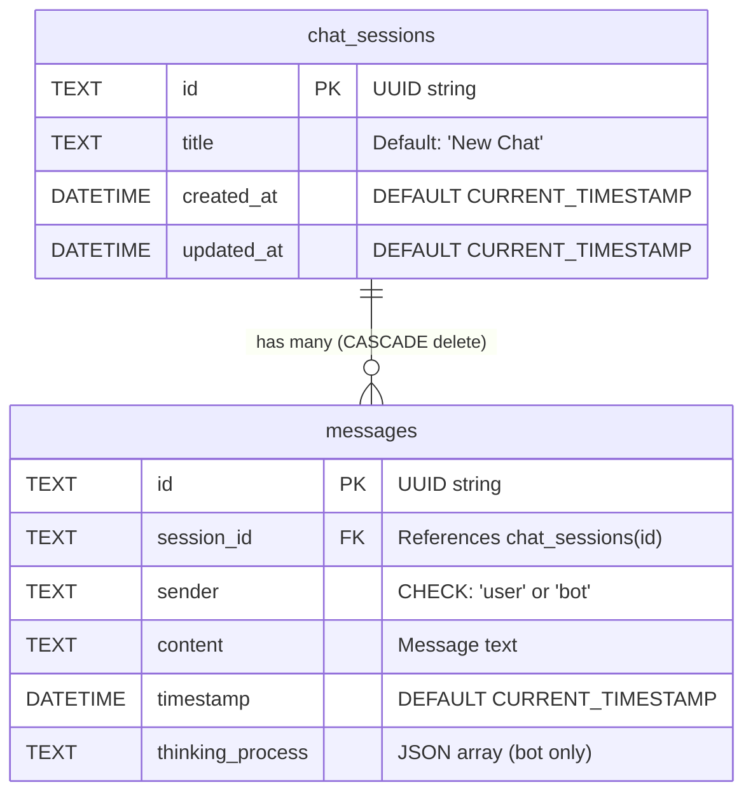

# Database Schema

RAG42 uses **SQLite** for persistent storage of chat sessions and messages. The database file is located at `{RAG42_STORAGE_DIR}/chat_history.db`.

## Entity Relationship Diagram



## Table Definitions

### chat_sessions

Stores metadata about each conversation.

```sql
CREATE TABLE IF NOT EXISTS chat_sessions (
    id TEXT PRIMARY KEY,           -- UUID string, e.g. "550e8400-e29b-41d4-a716-446655440000"
    title TEXT NOT NULL DEFAULT 'New Chat',
    created_at DATETIME DEFAULT CURRENT_TIMESTAMP,
    updated_at DATETIME DEFAULT CURRENT_TIMESTAMP
);
```

| Column | Type | Constraints | Description |
|--------|------|------------|-------------|
| `id` | TEXT | PRIMARY KEY | UUID generated by the server (`uuid.uuid4()`) |
| `title` | TEXT | NOT NULL, DEFAULT `'New Chat'` | Auto-set to first 20 chars of the first user message |
| `created_at` | DATETIME | DEFAULT CURRENT_TIMESTAMP | When the session was created |
| `updated_at` | DATETIME | DEFAULT CURRENT_TIMESTAMP | Last activity timestamp |

### messages

Stores individual messages within a chat session.

```sql
CREATE TABLE IF NOT EXISTS messages (
    id TEXT PRIMARY KEY,           -- UUID string
    session_id TEXT NOT NULL,      -- Foreign key to chat_sessions
    sender TEXT NOT NULL CHECK(sender IN ('user', 'bot')),
    content TEXT NOT NULL,
    timestamp DATETIME DEFAULT CURRENT_TIMESTAMP,
    thinking_process TEXT,          -- JSON string (RAG reasoning steps)
    FOREIGN KEY (session_id) REFERENCES chat_sessions(id) ON DELETE CASCADE
);
```

| Column | Type | Constraints | Description |
|--------|------|------------|-------------|
| `id` | TEXT | PRIMARY KEY | UUID generated by the server |
| `session_id` | TEXT | NOT NULL, FOREIGN KEY | References `chat_sessions.id` |
| `sender` | TEXT | NOT NULL, CHECK | Either `'user'` or `'bot'` |
| `content` | TEXT | NOT NULL | The message text |
| `timestamp` | DATETIME | DEFAULT CURRENT_TIMESTAMP | When the message was created |
| `thinking_process` | TEXT | nullable | JSON-encoded array of RAG reasoning steps (only set for bot messages) |

## Indexes

Two indexes improve query performance:

```sql
-- Fast lookup of messages by chat session
CREATE INDEX IF NOT EXISTS idx_messages_session_id
    ON messages(session_id);

-- Fast sorting of chat sessions by recency
CREATE INDEX IF NOT EXISTS idx_chat_sessions_updated_at
    ON chat_sessions(updated_at DESC);
```

| Index | Table | Purpose |
|-------|-------|---------|
| `idx_messages_session_id` | messages | Speeds up `SELECT ... WHERE session_id = ?` |
| `idx_chat_sessions_updated_at` | chat_sessions | Speeds up `ORDER BY updated_at DESC` for the chat list |

## UUID Primary Keys

Both tables use **UUID strings** as primary keys instead of auto-incrementing integers. The server generates UUIDs in Python:

```python
import uuid
new_id = str(uuid.uuid4())
# Result: "550e8400-e29b-41d4-a716-446655440000"
```

Benefits of UUIDs:
- IDs can be generated client-side without a database round-trip
- No sequential ID guessing (better security)
- Safe for distributed systems if you scale later

## CASCADE Delete

When a chat session is deleted, all its messages are automatically deleted:

```sql
FOREIGN KEY (session_id) REFERENCES chat_sessions(id) ON DELETE CASCADE
```

This means the `DELETE /api/chat/<chat_id>` endpoint only needs to delete the session row. SQLite handles the rest:

```python
# From server.py -- only deletes the session; messages cascade automatically
cur.execute('DELETE FROM chat_sessions WHERE id = ?', (chat_id,))
conn.commit()
```

:::warning
CASCADE delete is irreversible. There is no soft-delete or trash mechanism. Deleting a chat permanently removes all its messages.
:::

## Database Initialization

The schema is applied when the server starts, using SQLite's `CREATE TABLE IF NOT EXISTS` so it is safe to run multiple times:

```python
# From server.py
def init_db():
    with app.app_context():
        db = get_db_connection()
        with app.open_resource('db_init.sql', mode='r') as f:
            db.cursor().executescript(f.read())
        db.commit()
        db.close()
```

## Connection Pattern

The server uses a helper function that returns rows as dictionaries (via `sqlite3.Row`):

```python
def get_db_connection():
    conn = sqlite3.connect(DATABASE_PATH)
    conn.row_factory = sqlite3.Row  # Fetch rows as dictionaries
    return conn
```

:::note
SQLite is a file-based database. It does not support multiple concurrent writers well. For the RAG42 use case (single server, moderate load) this is fine. For high-concurrency production, consider migrating to PostgreSQL.
:::
