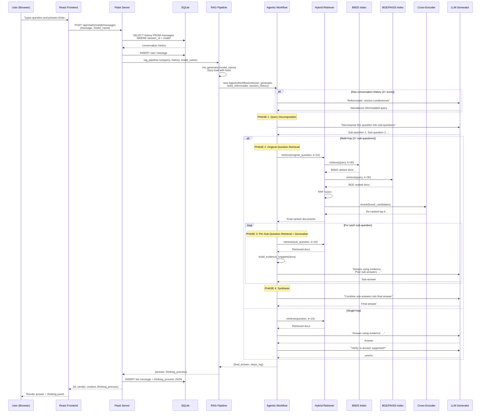
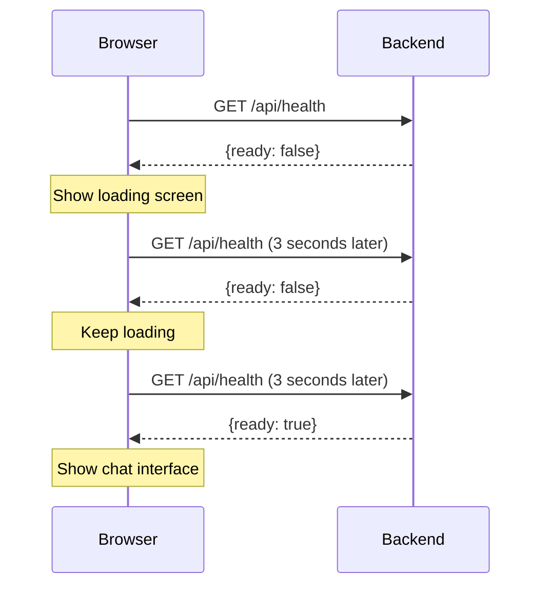

# Data Flow

This page traces a single user question through the entire RAG42 system, from the browser to the database and back.

## End-to-End Request Flow

When a user sends a question, here is exactly what happens at each layer:



## Step-by-Step Breakdown

### 1. Frontend sends the request

The React `ChatPanel` component sends a POST request:

```
POST /api/chat/{chatId}/messages
Content-Type: application/json

{
  "message": "Who directed the movie starring the actor who won Best Actor in 2020?",
  "model_name": "Qwen/Qwen2.5-0.5B-Instruct"
}
```

### 2. Flask server handles the request

In `server.py`, the `send_message()` endpoint:

1. Validates the request (message not empty, under 10,000 characters)
2. Checks that the chat session exists in SQLite
3. Loads the full conversation history for this session (for multi-turn support)
4. Stores the user message in the database
5. Calls `rag_pipeline.run(query, session_history, model_name)`

### 3. RAG Pipeline orchestrates

`RAGPipeline.run()` in `rag_pipeline.py`:

1. Initializes the generator if not already loaded (lazy init with double-checked locking)
2. Decides whether to use `AgenticWorkflow` or `SingleHopWorkflow`
3. Creates a workflow instance and calls `workflow.run(query)`
4. Formats the result into `{answer, thinking_process}`

### 4. Agentic Workflow executes

`AgenticWorkflow.run()` in `agentic_workflow.py` performs these phases:

**Phase 1 -- Query Reformulation** (if multi-turn):
- Uses the LLM to resolve coreferences like "he", "it", "that movie"
- Example: "What about his wife?" becomes "Where was Barack Obama's wife born?"

**Phase 2 -- Query Decomposition**:
- Sends a few-shot prompt to the LLM asking it to break the question into sub-questions
- If fewer than 2 sub-questions are produced, falls back to single-hop mode

**Phase 3 -- Retrieval and Generation per Sub-question**:
- For each sub-question, retrieves documents using `HybridRetriever`
- Builds evidence snippets (truncated to 8,000 characters)
- Generates a short answer using the LLM, with prior sub-answers as context (chain reasoning)

**Phase 4 -- Synthesis**:
- Combines all sub-answers into a final answer using the LLM
- Post-processes the answer to extract a clean entity or phrase

### 5. Hybrid Retrieval pipeline

`HybridRetriever.retrieve()` in `hybrid_retriever.py`:

1. Runs `SparseRetriever.retrieve()` (BM25) to get 3x the requested number of candidates
2. Runs `DenseRetriever.retrieve()` (BGE + FAISS) to get 3x candidates
3. Applies **Reciprocal Rank Fusion (RRF)**: `score(doc) = 1/(k + rank_bm25) + 1/(k + rank_bge)`
4. Passes fused candidates to `CrossEncoderReranker.rerank()` for final scoring
5. Returns the top-k documents

### 6. Response stored and returned

Back in `server.py`:

1. The bot response and thinking process are stored in the `messages` table
2. If this is the second message in the chat, the session title is auto-updated (first 20 characters of the user's question)
3. The JSON response is returned to the frontend

## Async Initialization

The RAG modules (retriever, indices) do not block server startup. In `server.py`:

```python
if __name__ == '__main__':
    init_db()                    # Create SQLite tables (fast)
    init_thread = threading.Thread(
        target=initialize_rag_modules,  # Load indices (slow)
        daemon=True
    )
    init_thread.start()          # Start in background
    app.run(...)                 # Flask starts immediately
```

The `initialize_rag_modules()` function:

1. Creates a `HybridRetriever` (which loads BM25 + BGE indices from cache)
2. Creates a `RAGPipeline` wrapping the retriever
3. Sets `RAG_Initialized = True` under a lock

Until `RAG_Initialized` is `True`, the `/api/health` endpoint returns `"ready": false` and message endpoints return a 500 error.

## Thread Safety

RAG42 uses two locks to handle concurrent access:

### `init_lock`

Protects the one-time initialization of RAG modules. Multiple requests arriving during startup will all wait on this lock; only the first one actually initializes, and the rest see `RAG_Initialized = True` and return immediately.

### `_generator_lock`

Protects lazy generator initialization in `RAGPipeline.init_generator()`. Uses double-checked locking:

```python
def init_generator(self, model_name: str):
    # Fast path: already initialized
    if model_name in self.generator_map:
        return self.generator_map[model_name]

    with self._generator_lock:
        # Slow path: check again after acquiring lock
        if model_name in self.generator_map:
            return self.generator_map[model_name]

        # Initialize the generator
        if model_name in self.GENERATOR_REGISTRY:
            self.generator_map[model_name] = HuggingfaceGenerator(model_name)
        else:
            self.generator_map[model_name] = OpenAIGenerator(model_name)
```

This ensures that even if two requests arrive simultaneously requesting the same model, only one loads it.

:::warning
Flask's default development server is single-threaded. For production deployment with multiple workers, you would need to ensure the generator map is shared (e.g., via a process manager or by using a WSGI server with shared memory).
:::

## Health Check Polling Pattern

The frontend uses a polling pattern to detect when the backend is ready:



The `InitPage` component in the React frontend polls `/api/health` at a regular interval. Once `ready` becomes `true`, it navigates to the `ChatPage`. This gives users a clear indication that the system is loading large indices.

:::note
The loading time depends on whether cached indices are available. With cache: 1-2 minutes. Without cache: 3+ hours (BM25 indexing dominates).
:::
