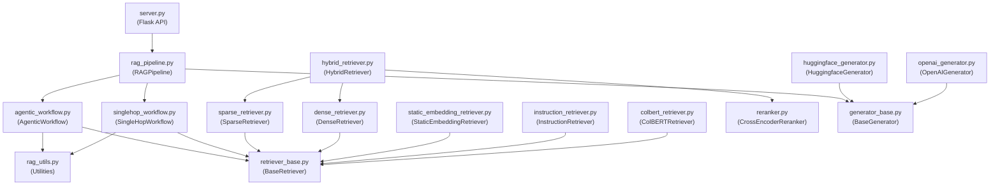
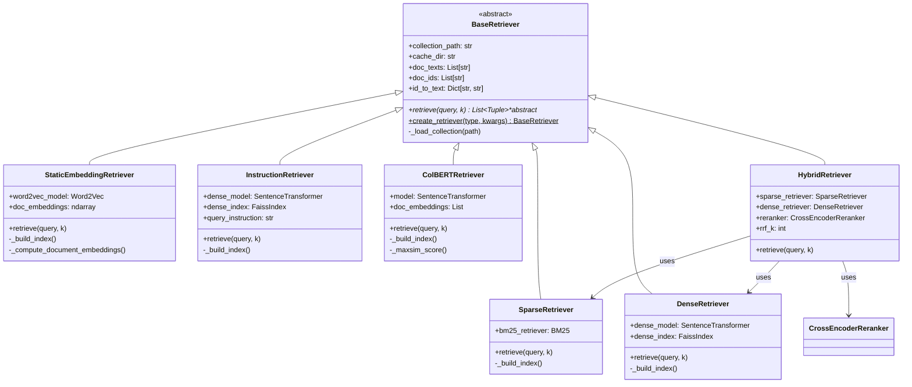
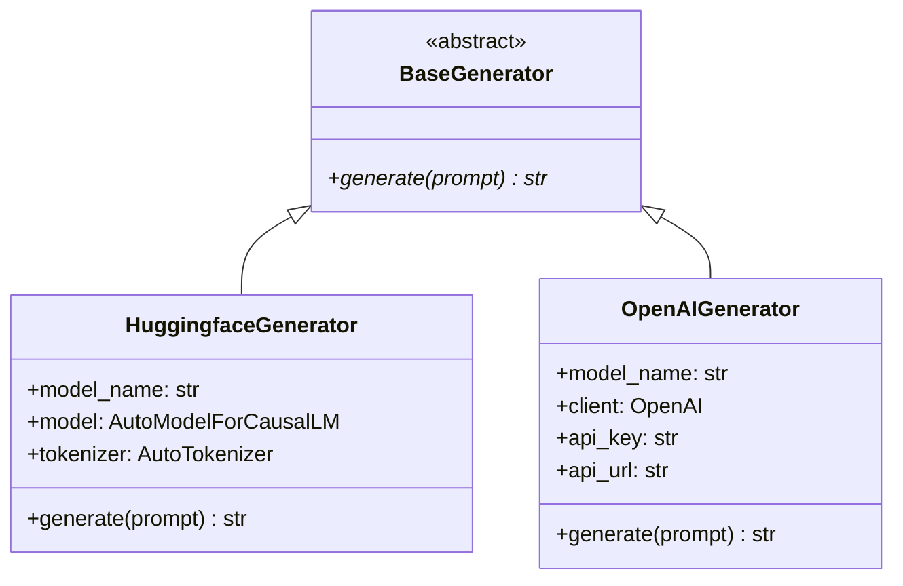

# System Architecture Overview

This page describes the internal architecture of RAG42: the directory structure, module relationships, class hierarchies, and design patterns.

## Directory Structure

```
PolyU-25Fall-COMP5423-RAG/
├── backend/
│   ├── server.py                  # Flask API server (routes, DB, async init)
│   ├── rag_pipeline.py            # Main orchestrator: ties retrieval + generation
│   ├── agentic_workflow.py        # Multi-hop decompose → retrieve → generate → synthesize
│   ├── singlehop_workflow.py      # Simple single-hop RAG baseline
│   ├── retriever_base.py          # BaseRetriever ABC + factory method
│   ├── sparse_retriever.py        # BM25 retrieval (bm25s library)
│   ├── dense_retriever.py         # BGE dense retrieval (Sentence Transformers + FAISS)
│   ├── static_embedding_retriever.py  # Word2Vec retrieval (gensim)
│   ├── instruction_retriever.py   # E5-instruct dense retrieval
│   ├── colbert_retriever.py       # ColBERT multi-vector retrieval
│   ├── hybrid_retriever.py        # BM25 + BGE + RRF fusion + reranker
│   ├── reranker.py                # Cross-encoder re-ranking (bge-reranker-v2-m3)
│   ├── generator_base.py          # BaseGenerator ABC
│   ├── huggingface_generator.py   # Local Qwen model via transformers
│   ├── openai_generator.py        # Remote LLM via OpenAI-compatible API
│   ├── rag_utils.py               # Shared utilities (answer post-processing, evidence building)
│   ├── db_init.sql                # SQLite schema initialization
│   ├── environment.yml            # Conda environment definition
│   ├── requirements.txt           # Python dependencies
│   └── Dockerfile                 # Backend Docker image
├── frontend/
│   ├── src/
│   │   ├── App.tsx                # Root component with routing
│   │   ├── ChatPage.tsx           # Main chat page layout
│   │   ├── InitPage.tsx           # Loading screen while backend initializes
│   │   ├── config.ts              # Model list and API URL configuration
│   │   └── components/
│   │       ├── ChatPanel.tsx      # Message list and input box
│   │       ├── Sidebar.tsx        # Chat session list
│   │       ├── ThinkingPanel.tsx  # Reasoning steps visualization
│   │       └── LoadingButton.tsx  # Animated loading button
│   ├── package.json
│   └── Dockerfile
├── evaluate/
│   ├── eval_hotpotqa.py           # Answer evaluation (F1, EM, pytrec_eval)
│   ├── eval_retrieval.py          # Retrieval evaluation (recall, precision)
│   └── test_predict.py            # Batch prediction script
├── .env.example
├── docker-compose.yml
├── build.sh
└── deploy.sh
```

## Module Dependency Diagram

The following diagram shows how the backend modules depend on each other:



## Class Diagram: Retrievers

All retrievers inherit from `BaseRetriever` and implement the `retrieve()` method:



## Class Diagram: Generators

Generators follow a simple abstract interface:



## Key Abstractions

### BaseRetriever (Abstract Base Class)

All retrievers extend `BaseRetriever`. This class handles loading the document collection and defines the `retrieve()` contract:

```python
# backend/retriever_base.py
class BaseRetriever(ABC):
    def __init__(self, collection_path: str, cache_dir: str, skip_load: bool = False):
        self.collection_path = collection_path
        self.cache_dir = cache_dir
        if not skip_load:
            self._load_collection(collection_path)

    @abstractmethod
    def retrieve(self, query: str, k: int = 20) -> List[Tuple[str, str, float]]:
        """Returns list of (doc_id, doc_text, score) tuples."""
        pass

    @classmethod
    def create_retriever(cls, retriever_type: str, **kwargs):
        """Factory method: 'sparse', 'dense', 'hybrid', etc."""
        ...
```

### BaseGenerator (Abstract Base Class)

Generators implement a single `generate()` method:

```python
# backend/generator_base.py
class BaseGenerator(ABC):
    @abstractmethod
    def generate(self, prompt: str) -> str:
        """Takes a prompt string, returns the generated response."""
        pass
```

## Design Patterns

RAG42 uses several well-known design patterns:

### 1. Abstract Base Class (ABC)

Both `BaseRetriever` and `BaseGenerator` are abstract classes that define a contract. Every retriever must implement `retrieve()`, and every generator must implement `generate()`. This makes it easy to add new retrieval or generation strategies without changing the rest of the system.

### 2. Factory Method

`BaseRetriever.create_retriever()` is a factory method that creates the right retriever subclass based on a string type:

```python
retriever = BaseRetriever.create_retriever("hybrid", collection_path="izhx/COMP5423-25Fall-HQ-small")
```

### 3. Strategy Pattern

The `RAGPipeline` treats the retriever and generator as interchangeable strategies. You can swap `HybridRetriever` for `SparseRetriever`, or `HuggingfaceGenerator` for `OpenAIGenerator`, without changing the pipeline logic.

### 4. Template Method

The `AgenticWorkflow.run()` method defines the overall algorithm skeleton (decompose, retrieve, generate per sub-question, synthesize), while the individual steps (how to decompose, how to retrieve) are implemented as separate methods that can be overridden.

### 5. Lazy Initialization with Double-Checked Locking

Generators are initialized on first use in `RAGPipeline.init_generator()`. The method uses a lock to ensure thread safety when multiple requests arrive before the generator is ready:

```python
def init_generator(self, model_name: str):
    if model_name in self.generator_map:
        return self.generator_map[model_name]
    with self._generator_lock:
        if model_name in self.generator_map:  # double-check
            return self.generator_map[model_name]
        # ... initialize generator ...
```

## Component Responsibilities

| Component | File | Responsibility |
|-----------|------|---------------|
| **Flask Server** | `server.py` | HTTP API, SQLite persistence, async RAG initialization |
| **RAG Pipeline** | `rag_pipeline.py` | Orchestrates retrieval + generation, manages generator lifecycle |
| **Agentic Workflow** | `agentic_workflow.py` | Multi-hop decomposition, chain reasoning, answer verification |
| **SingleHop Workflow** | `singlehop_workflow.py` | Simple single-step RAG (baseline) |
| **Hybrid Retriever** | `hybrid_retriever.py` | BM25 + BGE fusion with RRF and cross-encoder re-ranking |
| **Sparse Retriever** | `sparse_retriever.py` | BM25 retrieval via bm25s |
| **Dense Retriever** | `dense_retriever.py` | BGE embedding retrieval via FAISS |
| **Cross-Encoder** | `reranker.py` | Re-scores candidate documents using bge-reranker-v2-m3 |
| **HuggingFace Generator** | `huggingface_generator.py` | Local LLM inference (Qwen2.5) |
| **OpenAI Generator** | `openai_generator.py` | Remote LLM inference via OpenAI-compatible API |
| **RAG Utils** | `rag_utils.py` | Answer post-processing, evidence snippet building |

:::note Next steps
Continue to [Data Flow](./data-flow.md) to see how a single request moves through the entire system.
:::
