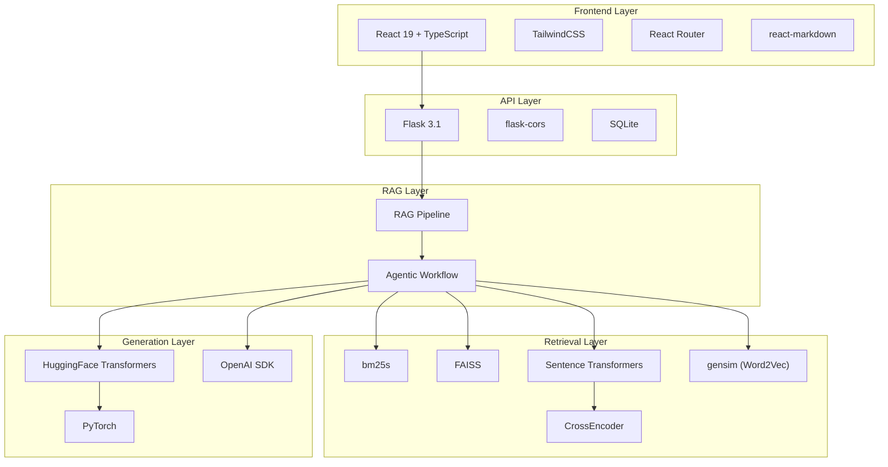

# Technology Stack

This page lists every technology used in RAG42, what it does, and why it was chosen.

## Backend

| Technology | Version | What It Does | Why It Was Chosen |
|-----------|---------|--------------|-------------------|
| **Python** | 3.12 | Primary backend language | Rich ML/NLP ecosystem; easy integration with HuggingFace, PyTorch, FAISS |
| **Flask** | 3.1.2 | Lightweight HTTP API framework | Minimal boilerplate; sufficient for a single-server RAG application |
| **flask-cors** | 6.0.1 | Cross-Origin Resource Sharing middleware | Allows the React frontend (port 3000) to call the Flask backend (port 5000) |
| **PyTorch** | 2.3.0 | Deep learning framework | Required by sentence-transformers and HuggingFace Transformers for model inference |
| **Transformers** | 4.57.1 | HuggingFace model loading and inference | Loads Qwen2.5 models for local generation; standard library for LLM inference |
| **Sentence Transformers** | 5.1.2 | Embedding model framework | Provides a simple API for encoding text with BGE, ColBERT, and other models; includes CrossEncoder for re-ranking |
| **FAISS** | 1.13.0 | Vector similarity search library | Fast nearest-neighbor search over dense embeddings; `IndexFlatIP` for exact cosine similarity |
| **bm25s** | 0.2.14 | BM25 sparse retrieval | Pure-Python BM25 implementation with caching support; fast tokenization and indexing |
| **gensim** | latest | Word2Vec training and inference | Simple API for training static word embeddings on the document corpus |
| **OpenAI** | latest | OpenAI-compatible API client | Enables connection to any OpenAI-compatible LLM service (DashScope, OpenAI, vLLM, etc.) |
| **accelerate** | 1.12.0 | HuggingFace model optimization | Handles device mapping and memory optimization for local LLM inference |
| **NLTK** | latest | Natural language toolkit | Stopword removal and tokenization utilities |
| **SQLite** | built-in | Embedded database | Zero-configuration database for chat history; no separate server needed |
| **python-dotenv** | latest | `.env` file loader | Reads environment variables from the `.env` file |
| **HuggingFace Datasets** | latest | Dataset loading | Downloads and caches the HotpotQA subset (`izhx/COMP5423-25Fall-HQ-small`) |
| **NumPy** | latest | Numerical computing | Array operations for embedding computation, cosine similarity, and RRF scoring |

## Frontend

| Technology | Version | What It Does | Why It Was Chosen |
|-----------|---------|--------------|-------------------|
| **React** | 19.2 | UI component library | Component-based architecture; large ecosystem; familiar to most frontend developers |
| **TypeScript** | 4.9 | Typed JavaScript | Catches type errors at compile time; better IDE support and autocompletion |
| **TailwindCSS** | 3.4 | Utility-first CSS framework | Rapid UI development without writing custom CSS; small bundle size with purging |
| **react-markdown** | 10.1 | Markdown rendering | Renders the bot's responses (which may contain markdown formatting) in the chat |
| **remark-gfm** | 4.0 | GitHub Flavored Markdown plugin | Enables tables, strikethrough, task lists, and other GFM features in rendered messages |
| **react-router-dom** | 7.9 | Client-side routing | Navigates between the loading page (`InitPage`) and the chat page (`ChatPage`) |
| **react-scripts** | 5.0 | Create React App build tooling | Zero-config Webpack, Babel, ESLint, and dev server; standard for React projects |

## Evaluation

| Technology | What It Does | Why It Was Chosen |
|-----------|--------------|-------------------|
| **pytrec_eval** | Information retrieval metrics | Standard library for computing MAP, NDCG, Recall@k used in TREC-style evaluation |
| **pandas** | Data manipulation | Loading evaluation results, computing statistics, and exporting to CSV |

:::info
The evaluation dependencies (`pytrec_eval`, `pandas`) are commented out in `requirements.txt` by default. Uncomment them if you want to run the evaluation scripts in the `evaluate/` directory.
:::

## Infrastructure

| Technology | What It Does | Why It Was Chosen |
|-----------|--------------|-------------------|
| **Docker** | Containerization | Reproducible builds; isolates Python and Node.js environments from the host system |
| **Docker Compose** | Multi-container orchestration | Defines backend and frontend services in a single `docker-compose.yml`; manages ports, volumes, and environment variables |
| **nginx** | Web server (in Docker frontend) | Serves the built React app in production; more efficient than the React dev server |
| **Conda** | Python environment management | Creates isolated Python environments with specific versions; handles PyTorch installation cleanly |
| **Git** | Version control | Tracks code changes; hosts the repository on GitHub |

## Model Choices

### Embedding Models

| Model | Used By | Purpose |
|-------|---------|---------|
| `BAAI/bge-large-en-v1.5` | `DenseRetriever` | Dense embedding model for document and query encoding. 1024-dimensional embeddings. Best quality among BGE family |
| `colbert-ir/colbertv2.0` | `ColBERTRetriever` | Multi-vector token-level embeddings for late-interaction retrieval |
| `intfloat/multilingual-e5-large-instruct` | `InstructionRetriever` | Instruction-tuned embedding model; requires task-specific prefixes |
| Word2Vec (trained on corpus) | `StaticEmbeddingRetriever` | 100-dimensional static embeddings; serves as a simple baseline |

### Re-ranking Model

| Model | Used By | Purpose |
|-------|---------|---------|
| `BAAI/bge-reranker-v2-m3` | `CrossEncoderReranker` | Cross-encoder that jointly encodes query-document pairs for precise relevance scoring |

### Generation Models

| Model | Type | Size | Notes |
|-------|------|------|-------|
| `Qwen/Qwen2.5-0.5B-Instruct` | Local (HuggingFace) | 0.5B | Default model; runs on CPU; fast but less accurate |
| `Qwen/Qwen2.5-1.5B-Instruct` | Local (HuggingFace) | 1.5B | Better quality, needs ~3GB RAM |
| `Qwen/Qwen2.5-3B-Instruct` | Local (HuggingFace) | 3B | Good balance of quality and speed |
| `Qwen/Qwen2.5-7B-Instruct` | Local (HuggingFace) | 7B | Best quality; needs GPU with 8GB+ VRAM |
| Any OpenAI-compatible model | API (remote) | varies | Configured via `RAG42_OPENAI_API_URL` and `RAG42_OPENAI_API_KEY` |

:::tip
For development and testing, the default `Qwen2.5-0.5B-Instruct` model is recommended. It runs on any machine without a GPU and produces reasonable results. For production-quality answers, use a larger model or an API-based service.
:::

## Architecture Diagram: Technology Layers

