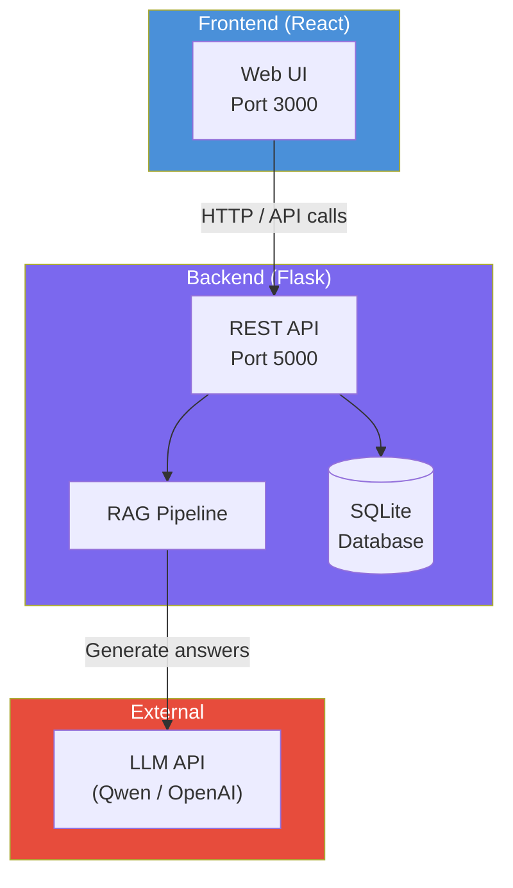

# Deployment Overview

RAG42 can be deployed in two ways: using Docker (recommended) or manually setting up each component. This page helps you choose the right approach and plan your time.

## Deployment Options

| Approach | Best for | Time estimate | Complexity |
|----------|----------|---------------|------------|
| **Docker** | Production, reproducible builds, team deployment | ~1 hour from scratch | Low |
| **Manual** | Development, debugging, understanding internals | 2-3 hours | Medium |

### Docker Deployment

Everything is containerized: the Flask backend, the React frontend, and all dependencies. One command builds and starts the entire system.

**Pros:**
- Reproducible environment across machines
- No dependency conflicts with your host system
- Easy to stop, restart, and clean up
- Volume mounts persist data and cache across restarts

**Cons:**
- Requires Docker and Docker Compose installed
- First build downloads large base images and dependencies
- GPU access requires additional Docker configuration

See the [Docker Deployment](./docker.md) guide for step-by-step instructions.

### Manual Deployment

Run the backend and frontend directly on your machine using Python and Node.js.

**Pros:**
- Full control over the environment
- Easier to debug and modify code
- Direct access to GPU without Docker configuration

**Cons:**
- Must manage dependencies manually (conda + pip + npm)
- Environment differences between team members
- Harder to reproduce on another machine

## Hardware Requirements

| Resource | Minimum | Recommended | Notes |
|----------|---------|-------------|-------|
| **RAM** | 8 GB | 16 GB | Dense retrievers and LLMs consume significant memory |
| **CPU** | 2 cores | 4+ cores | BM25 indexing and concurrent requests benefit from more cores |
| **GPU** | Not required | NVIDIA GPU with 8+ GB VRAM | Speeds up LLM inference 5-10x; CPU inference works but is slower |
| **Disk** | 10 GB free | 20 GB free | Model downloads (~4 GB) + BM25 cache (~2 GB) + database |

:::tip
GPU is optional. The system works on CPU-only machines, but LLM response times will be significantly slower (10-30 seconds vs 2-5 seconds per query).
:::

## Time Estimates

Plan your first deployment with these realistic time estimates:

| Stage | Docker | Manual | Notes |
|-------|--------|--------|-------|
| **Docker image build** | ~15 min | N/A | Downloads base images, installs conda env |
| **Model download** | ~10 min | ~10 min | Qwen2.5 models (~4 GB), cached after first run |
| **BM25 index build** | ~3+ hours | ~3+ hours | **Without cache** -- builds from scratch |
| **BM25 cache download** | ~5 min | ~5 min | **With cache** -- pre-built zip from GitHub releases |
| **Frontend build** | ~5 min | ~5 min | npm/pnpm install + build |
| **First startup** | ~2 min | ~2 min | RAG pipeline initialization |
| **Total (with cache)** | ~40 min | ~25 min | Recommended path |
| **Total (without cache)** | ~3.5 hours | ~3.5 hours | Only needed if cache is unavailable |

:::warning
Building the BM25 index from scratch takes 3+ hours and is the single biggest time sink. Always use the pre-built cache when available. The `build.sh` script downloads it automatically.
:::

## Architecture Overview

## Next Steps

- [Docker Deployment](./docker.md) -- complete Docker setup guide
