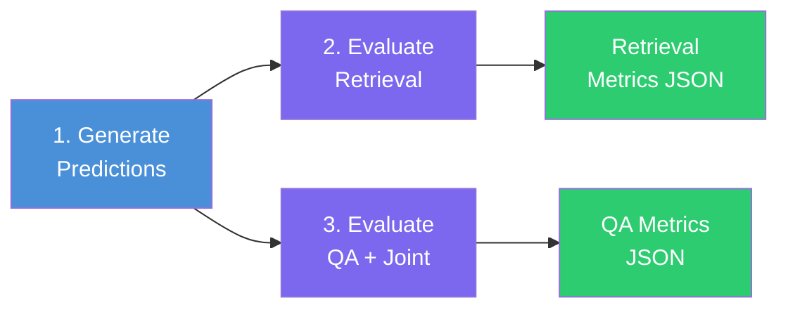

# Evaluation Overview

Evaluation is how you know whether your RAG system actually works. Without it, you are guessing. With it, you can compare retrievers, tune prompts, and prove that changes improve results.

## Two Types of Evaluation

RAG42 evaluates two independent dimensions:

| Dimension | What it measures | Script | Key metrics |
|---|---|---|---|
| **Retrieval quality** | Did the system find the right documents? | `eval_retrieval.py` | nDCG, MAP, Recall@k, Precision@k |
| **Answer accuracy** | Is the generated answer correct? | `eval_hotpotqa.py` | EM, F1, Precision, Recall |

A good RAG system needs both. Finding the right documents but generating a wrong answer is useless. Generating a fluent answer from the wrong documents is dangerous.

## Joint Metrics

RAG42 also computes **joint metrics** that combine retrieval and answer quality into a single number. This penalizes systems that excel at one but fail at the other:

```
Joint EM  = Answer EM  * Supporting Facts EM
Joint F1  = harmonic_mean(Answer F1, Supporting Facts F1)
```

A joint score of 1.0 means the system retrieved the correct supporting documents **and** produced the correct answer.

## Evaluation Pipeline

The evaluation runs in three stages:



1. **Generate predictions** (`test_predict.py`) -- run the RAG pipeline on a test dataset and save predictions to a JSONL file.
2. **Evaluate retrieval** (`eval_retrieval.py`) -- compare retrieved documents against ground-truth supporting facts.
3. **Evaluate QA** (`eval_hotpotqa.py`) -- compare generated answers against gold answers, and compute joint metrics using both answer correctness and supporting-fact correctness.

## Score Interpretation

Use this table as a rough guide when reading your results:

| Metric | Poor | Decent | Good | Excellent |
|--------|------|--------|------|-----------|
| **nDCG@10** | < 0.20 | 0.20 -- 0.40 | 0.40 -- 0.60 | > 0.60 |
| **MAP** | < 0.15 | 0.15 -- 0.35 | 0.35 -- 0.55 | > 0.55 |
| **Recall@10** | < 0.30 | 0.30 -- 0.50 | 0.50 -- 0.70 | > 0.70 |
| **Exact Match** | < 0.20 | 0.20 -- 0.40 | 0.40 -- 0.60 | > 0.60 |
| **F1** | < 0.30 | 0.30 -- 0.50 | 0.50 -- 0.70 | > 0.70 |
| **Joint EM** | < 0.10 | 0.10 -- 0.25 | 0.25 -- 0.45 | > 0.45 |

:::tip
These ranges are guidelines for the HotpotQA dataset. Your actual baselines will depend on your retriever, generator, and dataset difficulty.
:::

## Next Steps

- [Retrieval Metrics](./retrieval-metrics.md) -- deep dive into nDCG, MAP, Recall@k, and Precision@k
- [QA Metrics](./qa-metrics.md) -- deep dive into EM, F1, and supporting-facts evaluation
- [Running Evaluations](./running-eval.md) -- step-by-step commands to run the full evaluation pipeline
