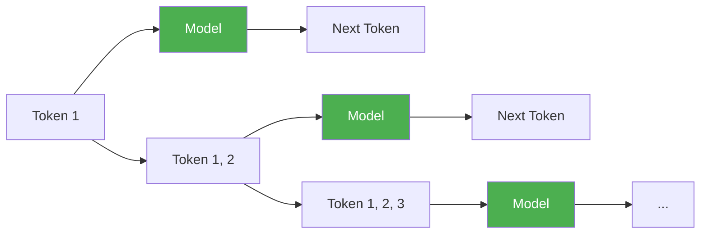
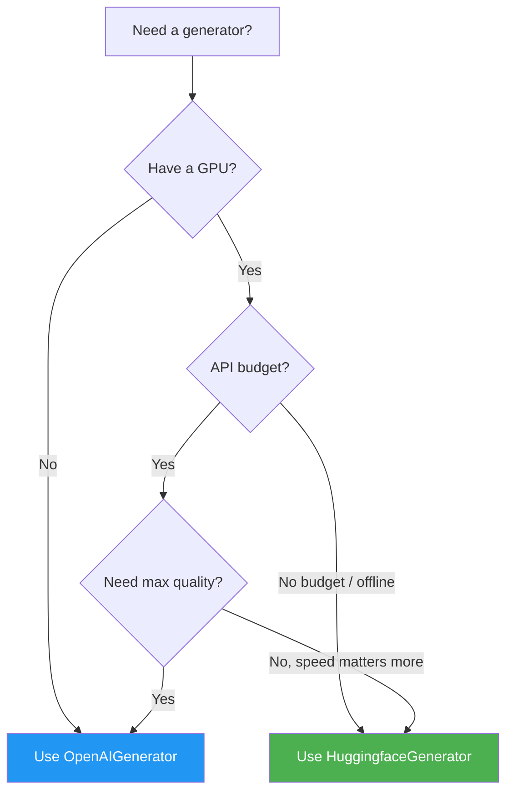

# Generator Implementations

This page covers the concrete generator classes in RAG42: how they work under the hood, how to configure them, and how to choose between them.

:::tip What you will learn
- The `BaseGenerator` abstract interface
- How `HuggingfaceGenerator` does tokenization and auto-regressive generation
- How `OpenAIGenerator` calls a remote API
- Model size comparison
- How to pick the right generator for your use case
:::

## BaseGenerator -- The Abstract Interface

Every generator in RAG42 inherits from `BaseGenerator`, an abstract base class (ABC) that defines the contract:

```python title="generator_base.py"
from abc import ABC, abstractmethod

class BaseGenerator(ABC):
    """
    Abstract base class for all generators.
    Provides a common interface for text generation.
    """

    @abstractmethod
    def generate(self, prompt: str) -> str:
        """
        Generates a response based on the given prompt.

        Args:
            prompt: The input prompt string.

        Returns:
            The generated response string.
        """
        pass
```

This is a simple interface: one method, one input (`prompt`), one output (`str`). All downstream code (workflows, pipelines) only depends on this interface, not on any specific implementation.

:::info Why use an ABC?
The abstract base class ensures that every generator implements the `generate` method. If someone forgets to implement it, Python raises a `TypeError` at instantiation time -- not at runtime when you try to call it.
:::

## HuggingfaceGenerator -- Local Model

The `HuggingfaceGenerator` runs a language model locally on your machine using the HuggingFace Transformers library. By default, it uses **Qwen2.5-0.5B-Instruct**.

### Initialization

```python title="huggingface_generator.py"
from transformers import AutoModelForCausalLM, AutoTokenizer
import torch

class HuggingfaceGenerator(BaseGenerator):
    def __init__(self, model_name: str = "Qwen/Qwen2.5-0.5B-Instruct"):
        self.model_name = model_name

        self.tokenizer = AutoTokenizer.from_pretrained(model_name)
        self.model = AutoModelForCausalLM.from_pretrained(
            model_name,
            torch_dtype=torch.float16 if torch.cuda.is_available() else torch.float32,
            device_map="auto"
        )
        self.model.eval()
```

Key points:

- **`AutoTokenizer.from_pretrained`** -- downloads the tokenizer that matches the model. The tokenizer converts text into numerical token IDs that the model understands.
- **`AutoModelForCausalLM.from_pretrained`** -- downloads the model weights. `CausalLM` means it is a left-to-right language model (it predicts the next token).
- **`torch_dtype`** -- uses `float16` on GPU (faster, less memory) or `float32` on CPU (slower, more precise).
- **`device_map="auto"`** -- automatically places the model on the best available device (GPU if available, otherwise CPU).
- **`model.eval()`** -- puts the model in evaluation mode (disables dropout and other training-specific behaviors).

### How Generation Works Step-by-Step

```python title="huggingface_generator.py -- generate method"
def generate(self, prompt: str) -> str:
    # Step 1: Format as a chat conversation
    messages = [
        {"role": "system", "content": "You are a precise question-answering assistant..."},
        {"role": "user", "content": prompt}
    ]

    # Step 2: Apply the model's chat template
    text = self.tokenizer.apply_chat_template(
        messages,
        tokenize=False,
        add_generation_prompt=True
    )

    # Step 3: Tokenize into numerical IDs
    model_inputs = self.tokenizer([text], return_tensors="pt").to(self.model.device)

    # Step 4: Generate tokens auto-regressively
    generated_ids = self.model.generate(
        **model_inputs,
        max_new_tokens=1024,
        do_sample=False,          # Greedy decoding (deterministic)
        pad_token_id=self.tokenizer.eos_token_id
    )

    # Step 5: Extract only the new tokens (remove the input)
    generated_ids = [
        output_ids[len(input_ids):]
        for input_ids, output_ids in zip(model_inputs.input_ids, generated_ids)
    ]

    # Step 6: Decode tokens back to text
    response = self.tokenizer.batch_decode(generated_ids, skip_special_tokens=True)[0].strip()
    return response
```

Let us break down each step:

#### Step 1-2: Chat Template

Most modern instruction-tuned models expect a specific conversation format. The **chat template** converts a list of messages (system, user, assistant) into a single string with special tokens:

```
<|im_start|>system
You are a precise question-answering assistant...<|im_end|>
<|im_start|>user
Answer the question using ONLY the evidence...<|im_end|>
<|im_start|>assistant
```

The `apply_chat_template` method handles this formatting automatically. The `add_generation_prompt=True` flag appends the assistant prefix so the model knows it should start generating a response.

#### Step 3: Tokenization

The tokenizer converts the formatted text into a sequence of integer token IDs. For example:

```
"Answer the question" -> [1234, 278, 3405]
```

Each integer maps to a sub-word unit in the model's vocabulary. The `return_tensors="pt"` flag returns PyTorch tensors, and `.to(self.model.device)` moves them to the same device (GPU/CPU) as the model.

#### Step 4: Auto-Regressive Generation

The model generates one token at a time, from left to right. At each step:

1. The model looks at all previous tokens
2. It computes a probability distribution over the next token
3. It picks the most likely token (greedy decoding, since `do_sample=False`)



This continues until:
- The model generates an end-of-sequence token, OR
- The output reaches `max_new_tokens` (1024 by default)

#### Step 5-6: Decode Only New Tokens

The raw output includes the input tokens followed by the generated tokens. We only want the new part (the model's response), so we slice off the input and decode the rest back into human-readable text.

## OpenAIGenerator -- Remote API

The `OpenAIGenerator` sends requests to a remote LLM via an OpenAI-compatible API. In RAG42, the default endpoint is **Aliyun DashScope**, but any OpenAI-compatible service works.

### Initialization

```python title="openai_generator.py"
from openai import OpenAI
import os

class OpenAIGenerator(BaseGenerator):
    def __init__(self, model_name: str = "qwen-turbo"):
        self.model_name = model_name

        self.api_key = os.getenv("RAG42_OPENAI_API_KEY")
        self.api_url = os.getenv("RAG42_OPENAI_API_URL")
        assert self.api_key is not None, "RAG42_OPENAI_API_KEY environment variable not set"
        assert self.api_url is not None, "RAG42_OPENAI_API_URL environment variable not set"

        self.client = OpenAI(
            api_key=self.api_key,
            base_url=self.api_url
        )
```

:::warning Environment variables required
You must set two environment variables before using the API generator:

```bash
export RAG42_OPENAI_API_KEY="your-api-key-here"
export RAG42_OPENAI_API_URL="https://dashscope.aliyuncs.com/compatible-mode/v1"
```

If either is missing, the generator raises an `AssertionError` at initialization.
:::

### Generation with Error Handling

```python title="openai_generator.py -- generate method"
def generate(self, prompt: str) -> str:
    try:
        response = self.client.chat.completions.create(
            model=self.model_name,
            messages=[
                {"role": "system", "content": "You are a precise question-answering assistant..."},
                {"role": "user", "content": prompt},
            ]
        )
        reply = response.choices[0].message.content
        return reply
    except Exception as e:
        raise RuntimeError(f"OpenAI API generation failed: {e}") from e
```

The API generator is much simpler than the local one -- the remote server handles tokenization, inference, and decoding. The key difference is error handling: network failures, rate limits, or invalid API keys all raise a `RuntimeError` with a descriptive message.

## Model Comparison

Here is a comparison of the models commonly used with RAG42:

| Model | Parameters | Type | Speed | Quality | Cost |
|-------|-----------|------|-------|---------|------|
| Qwen2.5-0.5B-Instruct | 0.5B | Local | Slow on CPU, fast on GPU | Basic | Free |
| Qwen2.5-1.5B-Instruct | 1.5B | Local | Medium | Better | Free |
| Qwen2.5-3B-Instruct | 3B | Local | Slower | Good | Free |
| Qwen2.5-7B-Instruct | 7B | Local | Slow without strong GPU | Very good | Free |
| qwen-turbo (DashScope) | Unknown (large) | API | 1-3 seconds | Excellent | Per-token billing |

:::info Key insight
The 0.5B model is very fast on a GPU but produces lower quality answers. The API model (qwen-turbo) produces much better answers because it is significantly larger, but it requires network access and costs money per request.
:::

## How to Choose Between Local and API



**Use HuggingfaceGenerator when:**
- You are running offline or in an air-gapped environment
- You have a GPU with at least 4 GB VRAM
- You want zero API cost
- You are okay with slightly lower answer quality

**Use OpenAIGenerator when:**
- You need the best possible answer quality
- You have a stable internet connection and API key
- You can tolerate network latency (~1-3 seconds per request)
- You are evaluating on benchmarks where accuracy matters most
