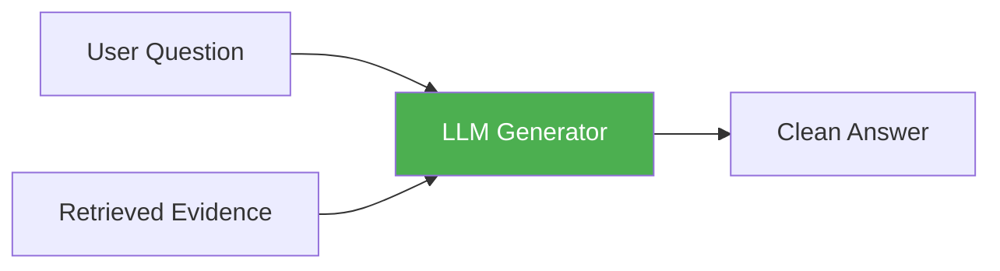
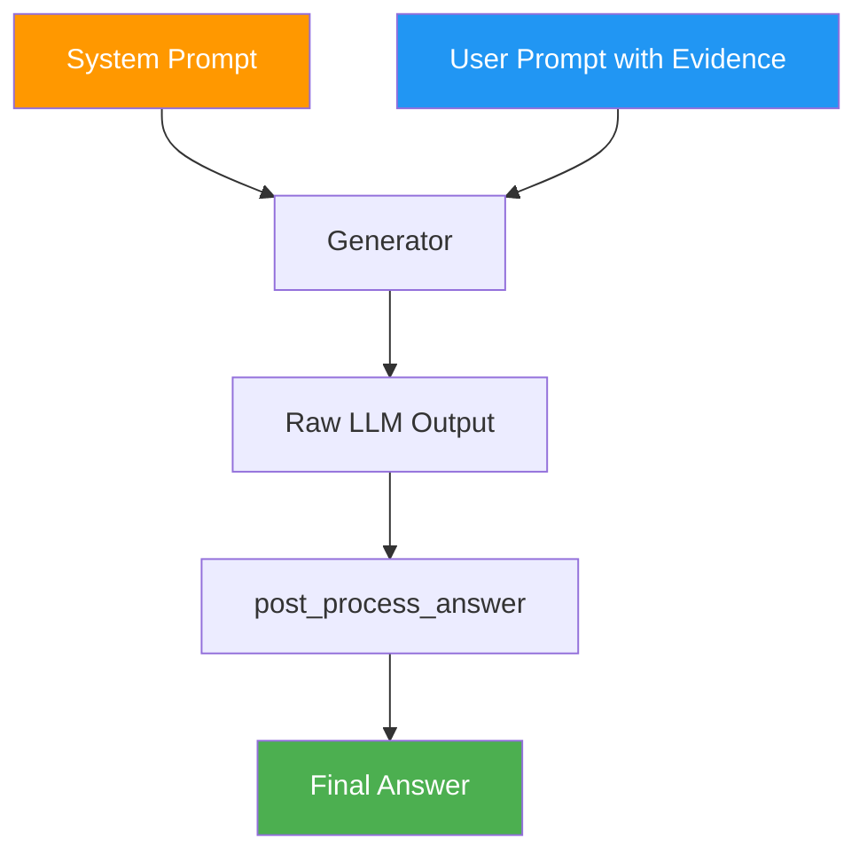

# Generation Module Overview

The **generation module** is the final stage of the RAG42 pipeline. After the retrieval module finds relevant documents, the generator reads those documents and produces a human-readable answer.

:::tip What you will learn
- What text generation means in a RAG system
- Why generation is harder than it looks
- The two types of generators in RAG42 (local vs API)
- How the generator registry pattern works
- How the system prompt shapes the output
:::

## What is Text Generation in RAG?

In a RAG system, **text generation** is the step where an LLM takes a question plus retrieved evidence and produces an answer. This sounds simple, but the generator must do four things at once:

1. **Understand the question** -- parse what the user is actually asking
2. **Locate the evidence** -- find the relevant sentences among potentially long documents
3. **Extract the answer** -- pull out the correct fact (a name, date, place, etc.)
4. **Format the output** -- return a short, clean answer without extra commentary



:::info Why not just use the LLM's own knowledge?
LLMs have parametric knowledge baked into their weights, but this knowledge can be outdated, incomplete, or flat-out wrong. RAG forces the model to answer **based on the retrieved documents**, making the answer factual and traceable.
:::

## The Two Generator Types

RAG42 supports two generator backends, both conforming to the same `BaseGenerator` interface:

| Type | Implementation | Model | Where it Runs |
|------|---------------|-------|---------------|
| **Local (HuggingFace)** | `HuggingfaceGenerator` | Qwen2.5-0.5B-Instruct | Your own machine |
| **API (OpenAI-compatible)** | `OpenAIGenerator` | qwen-turbo (Aliyun DashScope) | Remote cloud API |

### Local Generator (HuggingFace)

The local generator loads a small language model (0.5B parameters) directly onto your machine using the HuggingFace Transformers library. It runs inference locally, so:

- **No API key needed** -- works offline
- **No network latency** -- fast once loaded
- **Limited by hardware** -- needs a GPU for reasonable speed
- **Smaller model** -- less capable than large API models

### API Generator (OpenAI-compatible)

The API generator sends requests to a remote LLM service via the OpenAI-compatible API. In RAG42, this points to Aliyun DashScope by default. It:

- **Requires API key and URL** -- set via environment variables
- **Uses larger models** -- qwen-turbo is much more capable than 0.5B
- **Adds network latency** -- each request takes ~1-3 seconds
- **Costs money** -- API calls are billed per token

## The Generator Registry Pattern

RAG42 uses a **registry pattern** to decide which generator class to instantiate. The `RAGPipeline` maintains a `GENERATOR_REGISTRY` dictionary that maps model names to their type:

```python title="rag_pipeline.py -- Generator Registry"
class RAGPipeline:
    GENERATOR_REGISTRY = {
        "Qwen/Qwen2.5-0.5B-Instruct": "huggingface",
    }

    def init_generator(self, model_name: str):
        if model_name in self.generator_map:
            return self.generator_map[model_name]

        if model_name in self.GENERATOR_REGISTRY \
           and self.GENERATOR_REGISTRY[model_name] == "huggingface":
            self.generator_map[model_name] = HuggingfaceGenerator(model_name=model_name)
        else:
            self.generator_map[model_name] = OpenAIGenerator(model_name=model_name)
```

The logic is:

1. If the model name is in the registry and tagged `"huggingface"` -- use `HuggingfaceGenerator`
2. Otherwise -- assume it is an API model and use `OpenAIGenerator`

This means you can pass **any** HuggingFace model name or OpenAI API model name, and RAG42 will pick the right generator class automatically.

:::note Thread-safe initialization
The `init_generator` method uses a lock (`self._generator_lock`) with double-checked locking to ensure a generator is only loaded once, even when multiple requests arrive simultaneously.
:::

## System Prompt Design

Both generators share the same **system prompt**, which instructs the LLM to produce short, factual answers:

```
You are a precise question-answering assistant. Provide short, direct answers:
a single entity name, a short phrase, or 'yes'/'no'. Do not write full sentences
or add explanations.
```

This system prompt is critical because:

- It prevents the LLM from rambling with unnecessary explanations
- It matches the HotpotQA evaluation format (short entity answers)
- It keeps answers consistent across different generator backends



## Next Steps

- [Generator Implementations](./generators.md) -- deep dive into `HuggingfaceGenerator` and `OpenAIGenerator`
- [Prompt Engineering](./prompt-engineering.md) -- how prompts are constructed for different tasks
