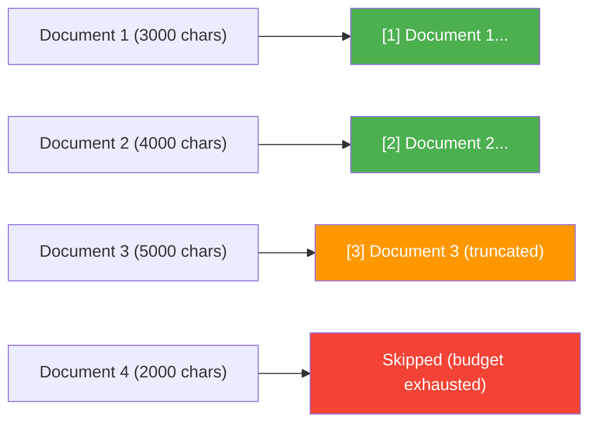

# Prompt Engineering

The quality of a RAG system depends as much on its prompts as on its models. This page explains how RAG42 designs prompts for different tasks, how evidence is formatted, and how raw LLM output is cleaned up.

:::tip What you will learn
- RAG42's prompt design principles
- The system prompt and its role
- Task-specific prompt templates (answering, decomposition, synthesis)
- Evidence truncation strategy
- Post-processing functions that clean up LLM output
:::

## Design Principles

RAG42 follows three principles for prompt design:

1. **Be explicit about format** -- tell the LLM exactly what kind of answer you want (short phrase, entity name, yes/no)
2. **Ground in evidence** -- always include retrieved documents and instruct the model to use ONLY that evidence
3. **Minimize verbosity** -- discourage full sentences and explanations, since HotpotQA expects short answers

## The System Prompt

Both `HuggingfaceGenerator` and `OpenAIGenerator` share the same system prompt:

```
You are a precise question-answering assistant. Provide short, direct answers:
a single entity name, a short phrase, or 'yes'/'no'. Do not write full sentences
or add explanations.
```

This prompt is prepended to every conversation as the `system` role. It sets the "personality" of the assistant -- in this case, a concise factual responder.

:::info Why the same system prompt for both generators?
Using the same system prompt ensures consistent behavior regardless of which generator backend is active. This makes it easier to compare results between the local and API models.
:::

## The Answering Prompt

The main answering prompt is used by both `SingleHopWorkflow` and `AgenticWorkflow` to generate answers from evidence:

```python title="agentic_workflow.py -- answer_from_docs"
prompt = (
    "Answer the question using ONLY the information in the evidence below. "
    "Your answer must be a short phrase, a single entity name, or 'yes'/'no'. "
    "Do NOT write a full sentence. Do NOT add explanations.\n\n"

    f"{prior_context}"
    "Evidence:\n"
    f"{evidence_snippets}\n\n"

    f"Question: {query}\n\n"

    "Answer:"
)
```

The prompt has four sections:

| Section | Purpose |
|---------|---------|
| **Instructions** | Tells the LLM to use only the evidence and produce a short answer |
| **Prior context** | (Optional) Previous sub-answers for chain reasoning in multi-hop |
| **Evidence** | Numbered document snippets, truncated to fit the token budget |
| **Question + cue** | The user's question followed by "Answer:" to cue the model to respond |

## The Decomposition Prompt

When the agentic workflow encounters a complex question, it uses a **few-shot prompt** to break the question into sub-questions:

```python title="agentic_workflow.py -- decompose_query"
few_shot = (
    "Example:\n"
    "Complex Question: Who was the director of the movie that won Best Picture "
    "at the 2020 Oscars?\n"
    "Sub-questions:\n"
    "1. Which movie won Best Picture at the 2020 Oscars?\n"
    "2. Who directed [answer from 1]?\n\n"
)

decomposition_prompt = (
    "You are an expert at breaking down complex questions. Decompose the "
    "following question into a sequence of simple, answerable sub-questions. "
    "Each sub-question must build logically on the previous one and use "
    "concrete entities. Do NOT answer -- just list sub-questions.\n\n"

    f"{few_shot}"
    f"Complex Question: {question}\n"
    "Sub-questions:\n"
    "1."
)
```

:::note Few-shot prompting
The example (few-shot) teaches the LLM the expected output format by showing it one complete input-output pair. This is much more reliable than just describing the format in natural language.
:::

## The Synthesis Prompt

After all sub-questions are answered, the synthesis prompt combines sub-answers into a final answer:

```python title="agentic_workflow.py -- synthesize_answer"
synthesis_prompt = (
    "You are given a complex question and the answers to its sub-questions. "
    "Combine the sub-answers to form a final, concise answer to the original question. "
    "Your answer must be a short phrase, a single entity name, or 'yes'/'no'. "
    "Do NOT write a full sentence. Do NOT add explanations.\n\n"

    f"Original Question: {question}\n\n"
    "Sub-answers:\n"
    f"{context_for_synthesis}\n\n"

    "Final Answer:"
)
```

This prompt presents the original question along with all collected sub-answers, then asks the LLM to produce one concise final answer.

## The Verification Prompt

The verification prompt checks whether a generated answer is actually supported by the evidence:

```python title="agentic_workflow.py -- verify_answer"
verify_prompt = (
    "Verify whether the following answer is directly supported by the evidence.\n\n"
    f"Question: {question}\n"
    f"Answer: {answer}\n\n"
    f"Evidence:\n{evidence[:3000]}\n\n"
    "Is the answer supported by the evidence? Respond with ONLY 'yes' or 'no'."
)
```

:::warning Evidence truncation in verification
The verification prompt truncates evidence to 3000 characters to keep the prompt short. This is a deliberate trade-off: shorter prompts are faster and cheaper, but may miss relevant context.
:::

## The Reformulation Prompt

For multi-turn conversations, the reformulation prompt converts a follow-up question into a standalone question:

```python title="agentic_workflow.py -- reformulate_query"
reformulation_prompt = (
    "You are a precise query rewriting assistant. Your ONLY task is to rewrite "
    "the final user query as a standalone question by resolving coreferences "
    "(e.g., 'he', 'his', 'it') using the conversation history. "
    "Do NOT change the user's intent, add information, or answer the question. "
    "Return ONLY the rewritten question -- no prefix, no explanation.\n\n"

    "Conversation History:\n"
    f"{conversation_text}\n\n"

    "Final User Query:\n"
    f"{query}\n\n"

    "Standalone Question:"
)
```

## Evidence Truncation Strategy

LLMs have a limited context window. To avoid exceeding it, RAG42 truncates evidence using a character budget:

```python title="rag_utils.py -- build_evidence_snippets"
def build_evidence_snippets(retrieved_docs: List[str], max_total_chars: int = 8000) -> str:
    snippets = []
    remaining = max_total_chars
    for i, doc in enumerate(retrieved_docs):
        if remaining <= 0:
            break
        snippet = doc[:remaining]
        snippets.append(f"[{i + 1}] {snippet}")
        remaining -= len(snippet)
    return "\n".join(snippets)
```

The strategy works as follows:

1. Start with a budget of **8000 characters** (the default `max_total_chars`)
2. For each document, take as many characters as the remaining budget allows
3. Prepend each snippet with a numbered tag: `[1]`, `[2]`, etc.
4. Stop adding documents once the budget is exhausted



:::tip Why 8000 characters?
8000 characters is roughly 2000-3000 tokens (depending on the language and tokenizer). This leaves room for the system prompt, instructions, question, and answer within the model's context window. For a 0.5B model, staying well under the context limit is important for generation quality.
:::

## Post-Processing

Raw LLM output is often messy. The `post_process_answer` function in `rag_utils.py` cleans it up:

```python title="rag_utils.py -- post_process_answer"
def post_process_answer(answer: str) -> str:
    answer = answer.strip()

    # Step 1: Remove common prefixes
    prefixes = [
        "Final Answer:", "Final answer:", "The answer is:",
        "The final answer is:", "Answer:", "A:",
        "Based on the evidence,", "Based on the information provided,",
    ]
    for prefix in prefixes:
        if answer.startswith(prefix):
            answer = answer[len(prefix):].strip()

    # Step 2: If multi-line, take the first non-empty line
    lines = [line.strip() for line in answer.split('\n') if line.strip()]
    if lines:
        answer = lines[0]

    # Step 3: Remove trailing period
    if answer.endswith('.'):
        answer = answer[:-1].strip()

    return answer
```

### What it fixes

| Problem | Example Raw Output | After Processing |
|---------|-------------------|-----------------|
| Prefix leak | `"The answer is: Honolulu"` | `"Honolulu"` |
| Multi-line verbosity | `"Joaquin Phoenix\nHe won for Joker..."` | `"Joaquin Phoenix"` |
| Trailing period | `"Todd Phillips."` | `"Todd Phillips"` |
| Extra whitespace | `"  Barack Obama  "` | `"Barack Obama"` |

:::info Why these specific prefixes?
The LLM sometimes ignores the "no explanations" instruction and still produces prefixes like "The answer is:" or "Based on the evidence,". The prefix list is based on common patterns observed during development. You may need to add more prefixes if you switch to a different model.
:::

## Summary of All Prompts

| Prompt | Used In | Purpose |
|--------|---------|---------|
| System prompt | All generators | Sets the "concise answerer" personality |
| Answering prompt | `answer_from_docs` | Generate answer from evidence |
| Decomposition prompt | `decompose_query` | Break complex question into sub-questions |
| Synthesis prompt | `synthesize_answer` | Combine sub-answers into final answer |
| Verification prompt | `verify_answer` | Check if answer is supported by evidence |
| Reformulation prompt | `reformulate_query` | Resolve coreferences in multi-turn |
