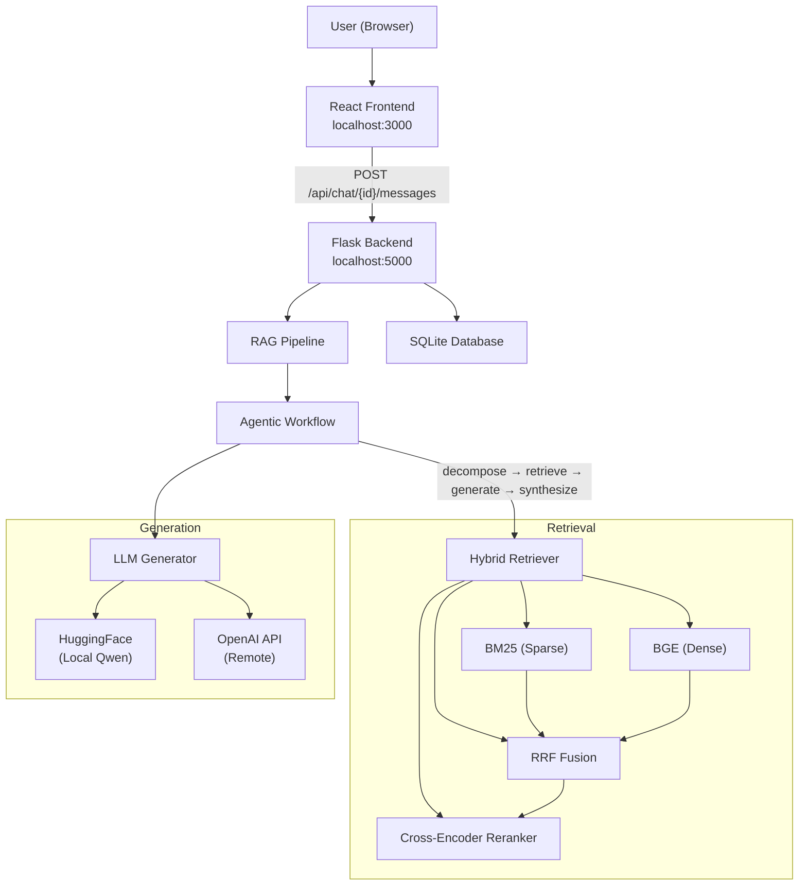

# What is RAG42?

RAG42 is a multi-hop Retrieval-Augmented Generation (RAG) system built for the [HotpotQA](https://hotpotqa.github.io/) dataset. It answers complex questions that require reasoning across multiple Wikipedia articles by combining hybrid retrieval, an agentic decomposition workflow, and large language model generation.

:::tip Who is this wiki for?
This wiki is written for beginner developers who know basic programming (Python, JavaScript) and have a general understanding of AI concepts like embeddings and LLMs. No prior RAG experience is required.
:::

## What is RAG?

**Retrieval-Augmented Generation (RAG)** is a technique that improves the accuracy of large language models (LLMs) by grounding their answers in retrieved documents. Instead of relying solely on the LLM's parametric knowledge, a RAG system:

1. **Retrieves** relevant documents from a knowledge base given a user query
2. **Augments** the LLM prompt with those documents as evidence
3. **Generates** an answer that is anchored in the retrieved facts

:::info Why does RAG matter?
LLMs can hallucinate or produce outdated information. RAG reduces this by forcing the model to cite and reason over actual documents. This makes answers more factual, traceable, and up-to-date.
:::

## What is Multi-Hop Question Answering?

A **single-hop** question can be answered from a single document. For example:

> "What is the capital of France?" -- Answer: Paris

A **multi-hop** question requires chaining facts from multiple documents. For example:

> "Who directed the movie starring the actor who won Best Actor in 2020?"

To answer this, you need to:
1. Find who won Best Actor in 2020 (Joaquin Phoenix)
2. Find a movie starring Joaquin Phoenix (e.g., Joker)
3. Find who directed that movie (Todd Phillips)

RAG42 is designed specifically for this kind of multi-step reasoning.

## What is HotpotQA?

[HotpotQA](https://hotpotqa.github.io/) is a question answering dataset that:

- Contains **multi-hop questions** over Wikipedia
- Requires reasoning across **two or more paragraphs**
- Provides **supporting fact annotations** so you can trace which sentences led to the answer
- Includes both **bridge** questions (entity chaining) and **comparison** questions

RAG42 uses a sampled subset called `HQ-small`, hosted on HuggingFace at [`izhx/COMP5423-25Fall-HQ-small`](https://huggingface.co/datasets/izhx/COMP5423-25Fall-HQ-small).

## Key Features

| Feature | Description |
|---------|-------------|
| **Hybrid Retrieval** | Combines BM25 (sparse) and BGE (dense) retrieval with Reciprocal Rank Fusion (RRF) |
| **Cross-Encoder Re-ranking** | Applies `BAAI/bge-reranker-v2-m3` to re-score fused candidates for higher precision |
| **Agentic Workflow** | Decomposes multi-hop questions into sub-questions, retrieves per sub-question, and synthesizes a final answer |
| **Answer Verification** | Re-generates answers that fail evidence-based verification |
| **Chain Reasoning** | Passes sub-answers from earlier hops as context to later ones |
| **Multi-turn Support** | Reformulates follow-up queries using conversation history |
| **Local + API LLMs** | Supports both local HuggingFace models (Qwen2.5) and remote OpenAI-compatible APIs |
| **Thinking Process UI** | Shows every reasoning step in the frontend so users can inspect the chain of thought |

## High-Level Architecture

The following diagram shows how the major components connect:

## How It Works (Summary)

1. A user types a question in the React chat UI
2. The frontend sends the question to the Flask backend via a REST API
3. The `RAGPipeline` delegates to the `AgenticWorkflow`
4. The workflow decomposes the question into sub-questions (for multi-hop)
5. For each sub-question, the `HybridRetriever` retrieves documents using BM25 + BGE + RRF + re-ranking
6. The LLM generates short answers for each sub-question
7. Sub-answers are synthesized into a final answer
8. The answer and full thinking process are returned to the frontend

:::note Next steps
Continue to the [Installation Guide](./installation.md) to set up RAG42 on your machine.
:::
