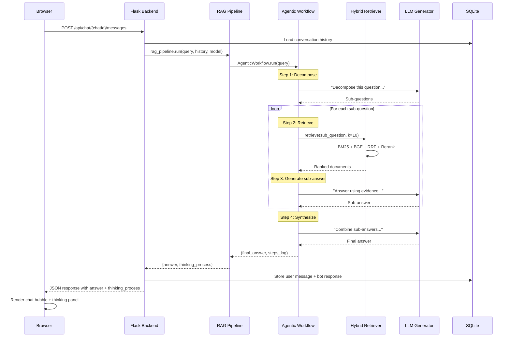

# Quick Start

Get RAG42 running and answer your first multi-hop question in 5 minutes.

:::prerequisites
Make sure you have completed the [Installation Guide](./installation.md) and have the cache files downloaded.
:::

## Step 1: Export Environment Variables

```bash
cd PolyU-25Fall-COMP5423-RAG
export $(grep -v '^#' .env | xargs)
```

## Step 2: Start the Backend

```bash
cd backend
python server.py
```

You will see log output indicating the server is starting:

```
== RAG42 Server Starting ==
Using storage directory: ./volumes/storage
Using cache directory: ./cache
Starting Flask app...
```

:::tip
The RAG modules (retriever + indices) load in a background thread. The Flask server is immediately available at port 5000, but the `ready` field in `/api/health` will be `false` until loading completes. On a typical machine with cached indices, this takes 1-2 minutes.
:::

## Step 3: Start the Frontend

In a **second terminal**:

```bash
cd frontend
npm start
```

The React dev server starts and opens your browser at `http://localhost:3000`.

## Step 4: Open the Browser

Navigate to `http://localhost:3000`. You will see a loading screen while the backend initializes.

The frontend polls the `/api/health` endpoint every few seconds. Once `ready` becomes `true`, the loading screen disappears and the chat interface appears.

## Step 5: Send a Test Question

Click "New Chat" in the sidebar, then type a multi-hop question:

```
Who directed the movie starring the actor who won Best Actor in 2020?
```

Press Enter or click the send button.

## Step 6: Observe the Thinking Process

The right panel shows the **thinking process** -- every step the agentic workflow took:

1. **Query Decomposition** -- The question is broken into sub-questions
2. **Retrieval for Sub-question 1** -- Documents retrieved for "Who won Best Actor in 2020?"
3. **Generated Answer 1** -- "Joaquin Phoenix"
4. **Retrieval for Sub-question 2** -- Documents retrieved for "Who directed the movie starring Joaquin Phoenix?"
5. **Generated Answer 2** -- "Todd Phillips"
6. **Synthesis** -- Final answer combined from sub-answers

Each step shows the retrieved documents with their relevance scores, so you can verify the system's reasoning.

## Request-Response Flow

Here is what happens behind the scenes when you send a question:



## Health Check Endpoint

The `/api/health` endpoint tells you whether the backend is ready:

```bash
curl http://localhost:5000/api/health
```

Response:

```json
{
  "ok": true,
  "storage": "./volumes/storage",
  "cache": "./cache",
  "logger": "./volumes/storage/rag.log",
  "db": "./volumes/storage/chat_history.db",
  "ready": true
}
```

| Field | Description |
|-------|-------------|
| `ok` | The Flask server is running |
| `ready` | RAG modules (retriever, indices) are fully loaded |
| `storage` | Path to the database and log files |
| `cache` | Path to the cached index files |
| `db` | Path to the SQLite database |
| `logger` | Path to the log file |

:::warning
If `ready` is `false`, the backend will return a 500 error when you try to send a message. Wait for the modules to finish loading.
:::

## Selecting a Model

You can choose which LLM to use from the frontend. The dropdown in the chat UI lets you pick from configured models:

- `Qwen/Qwen2.5-0.5B-Instruct` (local, runs on CPU/GPU)
- `Qwen/Qwen2.5-1.5B-Instruct`
- `Qwen/Qwen2.5-3B-Instruct`
- `Qwen/Qwen2.5-7B-Instruct`
- Any OpenAI-compatible API model

Local models are loaded on first use and cached in memory. API models require the `RAG42_OPENAI_API_KEY` and `RAG42_OPENAI_API_URL` environment variables.

:::note
The default model `Qwen/Qwen2.5-0.5B-Instruct` runs locally and works without an API key. It is small enough to run on a laptop with 16GB RAM.
:::

## Next Steps

- [Configuration Reference](./configuration.md) -- All environment variables explained
- [System Architecture](../architecture/index.md) -- Deep dive into the codebase
