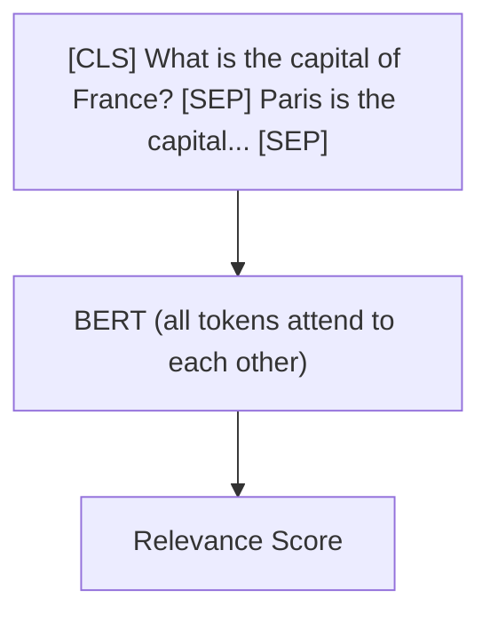
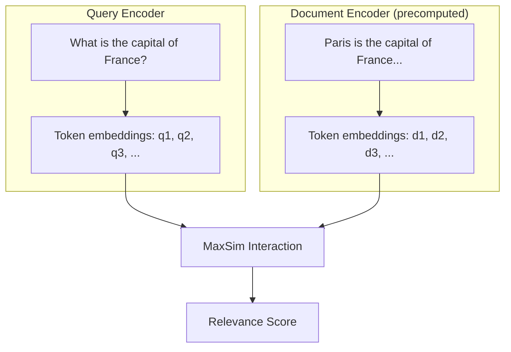

# Multi-vector Retrieval (ColBERT)

## What Is ColBERT?

**ColBERT** (Contextualized Late Interaction over BERT) is a retrieval model that represents each document and query not as a *single* vector, but as a *set of token-level vectors*. This allows much finer-grained matching — instead of asking "how similar are these two texts overall?", ColBERT asks "how well does each query token match the best-matching document token?"

The name captures its two key ideas:
- **Contextualized**: Uses BERT to produce context-aware token embeddings
- **Late Interaction**: Defers the interaction between query and document until *after* encoding

## Early vs. Late Interaction

Understanding ColBERT requires understanding the spectrum of interaction strategies:

### Early Interaction (Cross-Encoders)

A cross-encoder feeds the query and document *together* into a single model. Every token can attend to every other token from the start.



**Pro**: Maximum accuracy — the model sees all interactions.
**Con**: Extremely slow — you must run the model for *every* query-document pair. Cannot precompute.

### Late Interaction (ColBERT)

ColBERT encodes the query and document *independently*, then computes similarity *afterward* using a lightweight interaction step.



**Pro**: Documents can be encoded once and reused. Much faster at query time.
**Con**: Slightly less accurate than cross-encoders because token interactions are limited.

:::info Comparison
| | Cross-Encoder | ColBERT | Bi-Encoder (BGE) |
|---|---|---|---|
| **Interaction** | Early (all tokens) | Late (token-level) | None (single vector) |
| **Accuracy** | Highest | High | Good |
| **Speed** | Slowest | Moderate | Fastest |
| **Precomputable** | No | Yes (documents) | Yes (documents) |
| **Storage** | Low | High | Low |
:::

## MaxSim Scoring

ColBERT's scoring mechanism is called **MaxSim** (Maximum Similarity). Here is how it works:

For each query token, find the *most similar* document token. Then sum these maximum similarities across all query tokens.

`Score(Q, D) = SUM_i max_j sim(q_i, d_j)`

### Worked Example

Suppose a query has 3 tokens and a document has 4 tokens. After computing pairwise cosine similarities:

| | d1 ("Paris") | d2 ("is") | d3 ("the") | d4 ("capital") |
|---|---|---|---|---|
| **q1 ("what")** | 0.1 | **0.3** | 0.2 | 0.1 |
| **q2 ("capital")** | 0.2 | 0.1 | 0.1 | **0.9** |
| **q3 ("France")** | **0.8** | 0.1 | 0.2 | 0.3 |

**MaxSim calculation:**
- q1 ("what"): max = 0.3 (matches "is")
- q2 ("capital"): max = 0.9 (matches "capital")
- q3 ("France"): max = 0.8 (matches "Paris")

**Total score** = 0.3 + 0.9 + 0.8 = **2.0**

:::tip Why MaxSim Works
MaxSim captures *partial matching* — even if the document does not contain the exact query term, as long as *some* token in the document is semantically close, it gets credit. This is especially useful for multi-hop questions where evidence may be expressed differently than the question.
:::

## Storage and Speed Tradeoffs

The main cost of ColBERT is **storage**. Instead of storing one 1024-dimensional vector per document, you store one vector per *token* — roughly 100-200 vectors per document.

| Model | Vectors per doc | Dims | Storage per doc |
|---|---|---|---|
| BGE (bi-encoder) | 1 | 1024 | 4 KB |
| ColBERT | ~150 (avg) | 128 | ~77 KB |

For 5 million documents, this means ColBERT requires roughly **20x more storage** than a bi-encoder.

However, ColBERT is still much faster than a cross-encoder at query time, because document embeddings are precomputed and only the lightweight MaxSim step runs at query time.

## Full Implementation

Here is the complete `ColBERTRetriever` from RAG42:

```python
# colbert_retriever.py

import numpy as np
from retriever_base import BaseRetriever

class ColBERTRetriever(BaseRetriever):
    def __init__(
        self,
        collection_path: str,
        model_name: str = "colbert-ir/colbertv2.0",
        use_cache: bool = True,
        cache_dir: str = "./cache",
        max_doc_length: int = 180,
        max_query_length: int = 32
    ):
        self.model_name = model_name
        self.use_cache = use_cache
        self.max_doc_length = max_doc_length
        self.max_query_length = max_query_length
        super().__init__(collection_path, cache_dir)
        self._build_index()

    def _build_index(self):
        """Builds the ColBERT index by encoding all documents."""
        cache_path = os.path.join(
            self.cache_dir,
            f"colbert_index_{self.model_name.replace('/', '_')}.npy"
        )
        cache_path_ids = os.path.join(
            self.cache_dir,
            f"colbert_index_{self.model_name.replace('/', '_')}_lengths.npy"
        )

        if self.use_cache and os.path.exists(cache_path):
            from sentence_transformers import SentenceTransformer
            self.model = SentenceTransformer(self.model_name)
            self.doc_embeddings = np.load(cache_path, allow_pickle=True)
            self.doc_lengths = np.load(cache_path_ids, allow_pickle=True)
            return

        from sentence_transformers import SentenceTransformer
        self.model = SentenceTransformer(self.model_name)

        # Encode documents with token-level embeddings
        all_doc_embs = []
        self.doc_lengths = []
        batch_size = 32

        for i in range(0, len(self.doc_texts), batch_size):
            batch = self.doc_texts[i:i + batch_size]
            batch_embs = self.model.encode(batch, batch_size=batch_size)
            for emb in batch_embs:
                if emb.ndim == 1:
                    emb = emb.reshape(1, -1)
                all_doc_embs.append(emb)
                self.doc_lengths.append(emb.shape[0])

        self.doc_embeddings = all_doc_embs
        self.doc_lengths = np.array(self.doc_lengths)

        if self.use_cache:
            np.save(cache_path, self.doc_embeddings, allow_pickle=True)
            np.save(cache_path_ids, self.doc_lengths, allow_pickle=True)

    def _maxsim_score(self, query_embs, doc_embs):
        """
        Compute ColBERT MaxSim score.
        Score = sum over query tokens of max similarity to any doc token.
        """
        # Normalize for cosine similarity
        query_norm = query_embs / (
            np.linalg.norm(query_embs, axis=1, keepdims=True) + 1e-10
        )
        doc_norm = doc_embs / (
            np.linalg.norm(doc_embs, axis=1, keepdims=True) + 1e-10
        )

        # Pairwise cosine similarity matrix (q_len x d_len)
        sim_matrix = np.dot(query_norm, doc_norm.T)

        # For each query token, take max similarity to any doc token
        max_sims = np.max(sim_matrix, axis=1)

        # Sum across all query tokens
        return float(np.sum(max_sims))

    def retrieve(self, query: str, k: int = 20):
        """Retrieves top-k documents using ColBERT MaxSim scoring."""
        # Encode query into token-level embeddings
        query_emb = self.model.encode([query])[0]
        if query_emb.ndim == 1:
            query_emb = query_emb.reshape(1, -1)

        # Score all documents
        scores = []
        for i, doc_emb in enumerate(self.doc_embeddings):
            score = self._maxsim_score(query_emb, doc_emb)
            scores.append((self.doc_ids[i], self.doc_texts[i], score))

        # Sort by score descending and return top-k
        scores.sort(key=lambda x: x[2], reverse=True)
        return scores[:k]
```

### Key Implementation Details

1. **Token-level storage**: Each document is stored as a 2D array of token embeddings, not a single vector. This is the fundamental difference from bi-encoders.
2. **MaxSim implementation**: The `_maxsim_score` method computes pairwise cosine similarity between all query and document tokens, then takes the max per query token and sums.
3. **No FAISS**: Unlike single-vector retrievers, ColBERT cannot use standard FAISS indexes because the scoring is not a simple dot product. Retrieval requires scoring each document individually.
4. **Caching**: Token-level embeddings are cached as NumPy arrays (`.npy` files).

:::warning Performance
Since ColBERT cannot use FAISS, it scores *every* document at query time. For the HotpotQA collection (~5 million documents), this can be slow. Consider using ColBERT in a two-stage pipeline: first retrieve candidates with a fast retriever (BM25 or BGE), then re-rank with ColBERT.
:::

## When to Use ColBERT

| Use Case | Why ColBERT? |
|---|---|
| **Re-ranking** | Perfect as a second-stage reranker after fast first-stage retrieval |
| **Partial matching** | MaxSim naturally handles documents that partially address the query |
| **Multi-hop QA** | Token-level matching can find subtle connections between documents |
| **Accuracy-critical** | When you need the best possible retrieval quality and can afford the cost |
