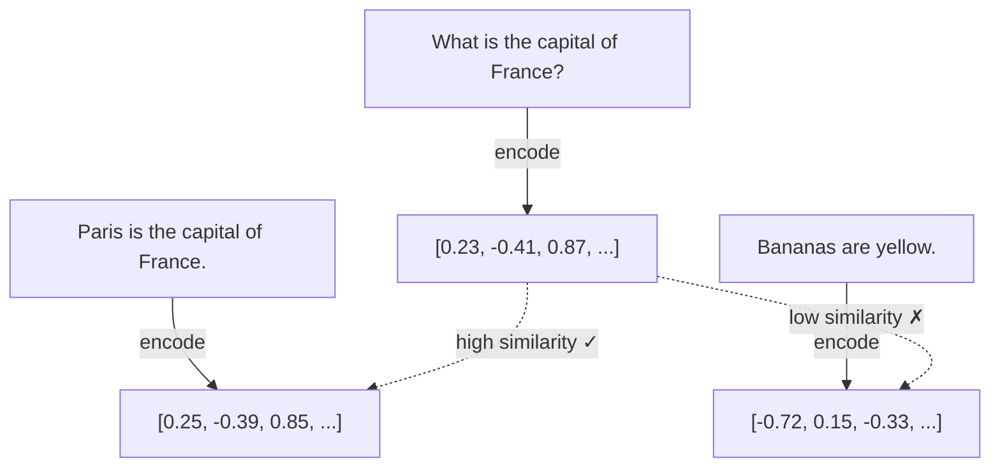

# Dense Retrieval (BGE)

## What Are Embeddings?

In sparse retrieval, documents are represented as bags of words — long, mostly-zero vectors where each dimension corresponds to a specific term. **Dense retrieval** takes a fundamentally different approach: it uses a neural network to compress a document's meaning into a short, dense vector.

Think of it as a coordinate system for meaning:

- The word **"king"** might live at coordinates `[0.8, 0.3, -0.1, ...]`
- The word **"queen"** would be nearby: `[0.7, 0.4, -0.1, ...]`
- The word **"banana"** would be far away: `[-0.5, -0.2, 0.9, ...]`

These coordinates are learned from data, and words with similar meanings end up close together in this high-dimensional space. This is why dense retrieval can match "What is the capital of France?" with "Paris is a city in Europe" — their embeddings are nearby even though they share few exact words.



## BGE Model Architecture

RAG42's `DenseRetriever` uses the **BAAI/bge-large-en-v1.5** model by default — a state-of-the-art English embedding model developed by the Beijing Academy of Artificial Intelligence (BAAI).

| Property | Value |
|---|---|
| **Base architecture** | BERT-large |
| **Parameters** | ~326 million |
| **Embedding dimensions** | 1024 |
| **Max sequence length** | 512 tokens |
| **Training data** | Large-scale retrieval datasets with contrastive learning |

The model takes a piece of text, passes it through 24 transformer layers, and produces a single 1024-dimensional vector that captures its meaning. This process is called **encoding**.

:::info Why BGE?
BGE models consistently rank at the top of the [MTEB leaderboard](https://huggingface.co/spaces/mteb/leaderboard) for English retrieval tasks. The "large" variant offers a good balance of quality and speed.
:::

## Cosine Similarity

Once we have embeddings for both the query and all documents, we need a way to measure how "close" they are. The standard metric is **cosine similarity**:

`cosine_similarity(A, B) = (A . B) / (||A|| * ||B||)`

This measures the cosine of the angle between two vectors:

- **1.0** = vectors point in the same direction (identical meaning)
- **0.0** = vectors are perpendicular (unrelated)
- **-1.0** = vectors point in opposite directions (opposite meaning)

:::tip Normalization Trick
If vectors are **L2-normalized** (scaled to unit length), then cosine similarity simplifies to a simple dot product. This is exactly what RAG42 does — it normalizes all embeddings, then uses FAISS's `IndexFlatIP` (Inner Product) for fast similarity search.
:::

## FAISS for Efficient Search

Comparing a query embedding against millions of document embeddings one by one would be slow. **FAISS** (Facebook AI Similarity Search) solves this problem by building optimized index structures for fast nearest-neighbor search.

RAG42 uses `IndexFlatIP`, which performs an **exact** brute-force inner product search. While this is the simplest FAISS index, it is fast enough for the HotpotQA collection (~5 million documents) and guarantees no approximation errors.

```python
import faiss

# Build the index
dimension = doc_embeddings.shape[1]  # 1024 for BGE-large
index = faiss.IndexFlatIP(dimension)

# Normalize embeddings so inner product = cosine similarity
faiss.normalize_L2(doc_embeddings)

# Add all document embeddings to the index
index.add(doc_embeddings)

# Search: normalize query, then find top-k
faiss.normalize_L2(query_embedding)
scores, indices = index.search(query_embedding, k=20)
```

## Query Prefix for BGE Models

BGE models expect queries to be prepended with a special prefix to signal that the text is a search query (as opposed to a document):

```
Represent this sentence: What is the capital of France?
```

Documents are encoded *without* this prefix. This asymmetry helps the model distinguish between "what I'm looking for" and "what I might find."

```python
# Only queries get the prefix
self._query_prefix = "Represent this sentence: " if "bge" in model_name else ""
query_text = self._query_prefix + query
```

## Full Implementation

Here is the complete `DenseRetriever` from RAG42:

```python
# dense_retriever.py

import faiss
from sentence_transformers import SentenceTransformer
import numpy as np
from retriever_base import BaseRetriever

class DenseRetriever(BaseRetriever):
    def __init__(
        self,
        collection_path: str,
        dense_model_name: str = "BAAI/bge-large-en-v1.5",
        use_cache: bool = True,
        cache_dir: str = "./cache",
        skip_load: bool = False
    ):
        self.dense_model_name = dense_model_name
        self.use_cache = use_cache
        # BGE models require a query prefix
        self._query_prefix = (
            "Represent this sentence: "
            if "bge" in dense_model_name.lower()
            else ""
        )
        super().__init__(collection_path, cache_dir, skip_load=skip_load)
        if not skip_load:
            self._build_index()

    def _build_index(self):
        """Builds the FAISS index, loading from cache if available."""
        cache_path = os.path.join(
            self.cache_dir,
            f"faiss_index_{self.dense_model_name.replace('/', '_')}.faiss"
        )

        if self.use_cache and os.path.exists(cache_path):
            self.dense_model = SentenceTransformer(self.dense_model_name)
            self.dense_index = faiss.read_index(cache_path)
            return

        # Load the sentence transformer model
        self.dense_model = SentenceTransformer(self.dense_model_name)

        # Encode all documents in batches
        doc_embeddings = self.dense_model.encode(
            self.doc_texts, batch_size=64, show_progress_bar=True
        )

        # Build FAISS index with inner product (cosine sim after normalization)
        dimension = doc_embeddings.shape[1]
        self.dense_index = faiss.IndexFlatIP(dimension)
        faiss.normalize_L2(doc_embeddings)
        self.dense_index.add(doc_embeddings)

        # Cache the index
        if self.use_cache:
            faiss.write_index(self.dense_index, cache_path)

    def retrieve(self, query: str, k: int = 20):
        """Retrieves top-k documents using dense embeddings."""
        query_text = self._query_prefix + query
        query_emb = self.dense_model.encode([query_text])
        faiss.normalize_L2(query_emb)
        scores, indices = self.dense_index.search(query_emb, k=k)

        results = []
        for i in range(len(indices[0])):
            doc_idx = int(indices[0][i])
            doc_id = self.doc_ids[doc_idx]
            doc_text = self.doc_texts[doc_idx]
            score = float(scores[0][i])
            results.append((doc_id, doc_text, score))

        return results
```

### Key Implementation Details

1. **Lazy model loading**: The `SentenceTransformer` model is loaded once during initialization and reused for all queries.
2. **Batch encoding**: Documents are encoded in batches of 64 for efficiency.
3. **FAISS caching**: The built FAISS index is saved to a `.faiss` file, avoiding the expensive re-encoding step on subsequent runs.
4. **L2 normalization**: All embeddings are normalized before indexing and searching, so inner product equals cosine similarity.

:::warning First-Run Cost
The first time you run `DenseRetriever`, it must download the BGE model (~1.3 GB) and encode all ~5 million documents. This can take 30+ minutes depending on your hardware. Subsequent runs load from cache in seconds.
:::

## Advantages and Disadvantages

### When to Use Dense Retrieval

| Advantage | Explanation |
|---|---|
| **Semantic matching** | Understands meaning, not just exact words |
| **Synonym handling** | "automobile" matches "car" |
| **Multi-hop friendly** | Can find bridging documents through semantic similarity |
| **Query understanding** | Handles natural language questions well |

### When NOT to Use Dense Retrieval

| Disadvantage | Explanation |
|---|---|
| **Model download** | Requires downloading a large model (~1.3 GB) |
| **Encoding cost** | First-time indexing of millions of documents is slow |
| **Rare terms** | May struggle with very specific names or codes that were rare in training data |
| **GPU preferred** | Encoding is significantly faster on GPU; CPU encoding can be very slow |

:::tip Pro Tip
You can experiment with different BGE model sizes by changing `dense_model_name`:
- `"BAAI/bge-small-en-v1.5"` — fastest, 384 dims, good for prototyping
- `"BAAI/bge-base-en-v1.5"` — balanced, 768 dims
- `"BAAI/bge-large-en-v1.5"` — best quality, 1024 dims (default)
:::
