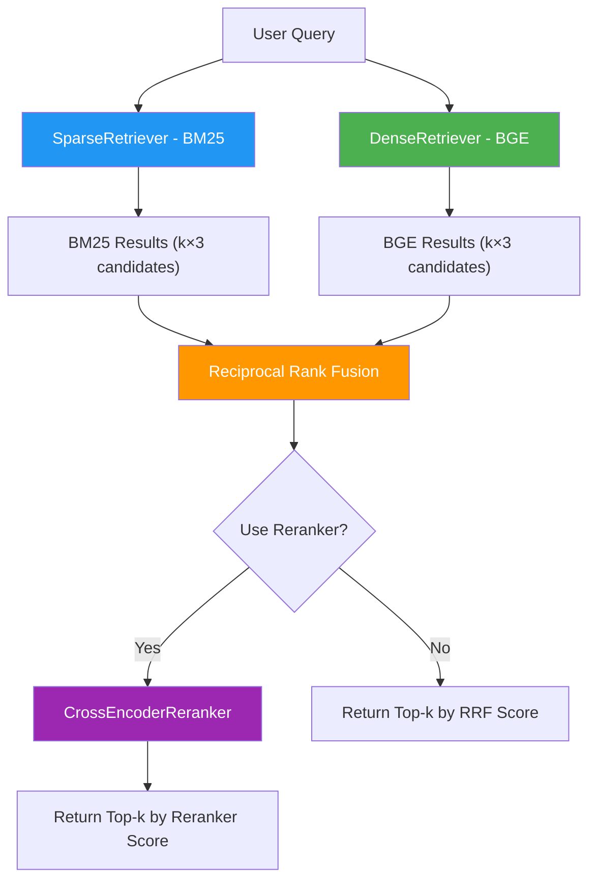

import RRFcalculator from '@site/src/components/RRFCalculator';

# Hybrid Retrieval with RRF

## Why Combine Sparse and Dense?

Sparse retrieval (BM25) and dense retrieval (BGE) have complementary strengths:

| Scenario | BM25 (Sparse) | BGE (Dense) |
|---|---|---|
| Query contains exact name ("Albert Einstein") | Strong match | May miss rare terms |
| Query uses synonyms ("automobile" vs. "car") | Misses | Matches |
| Query is a natural language question | Weaker | Strong |
| Document uses different wording than query | Misses | Matches |

**Hybrid retrieval** combines both approaches so that each method covers the other's weaknesses. If BM25 finds a document that BGE misses (or vice versa), the hybrid system still retrieves it.

:::info Research Insight
Studies on MS MARCO and other benchmarks consistently show that combining BM25 with dense retrieval improves recall by 5-10% over either method alone. The key challenge is *how* to combine the scores — and that is where Reciprocal Rank Fusion comes in.
:::

## The Problem: Incompatible Scores

You cannot simply add BM25 scores and embedding similarity scores together — they are on completely different scales. A BM25 score of 15.3 and a cosine similarity of 0.85 are not directly comparable.

**Reciprocal Rank Fusion (RRF)** solves this by ignoring raw scores entirely and using only *rank positions*.

## Reciprocal Rank Fusion Formula

`RRF(d) = SUM_r 1 / (k + rank_r(d))`

Where:
- $d$ is a document
- $R$ is the set of all ranked lists (one per retriever)
- `rank_r(d)` is the rank of document `d` in list `r` (1-indexed)
- $k$ is a constant (default: 60) that controls how much weight lower-ranked documents receive

### Worked Example

Suppose we retrieve top-5 documents from BM25 and BGE for the question *"Who wrote the play Hamlet?"*:

| Rank | BM25 Results | BGE Results |
|---|---|---|
| 1 | Doc A ("William Shakespeare wrote...") | Doc B ("Hamlet, a tragedy by Shakespeare...") |
| 2 | Doc C ("Hamlet is a play...") | Doc A ("William Shakespeare wrote...") |
| 3 | Doc D ("Denmark in literature...") | Doc C ("Hamlet is a play...") |
| 4 | Doc E ("Famous English playwrights...") | Doc E ("Famous English playwrights...") |
| 5 | Doc F ("Elizabethan theater...") | Doc D ("Denmark in literature...") |

**RRF calculation with k=60:**

| Doc | BM25 rank | BGE rank | RRF Score |
|---|---|---|---|
| **A** | 1 | 2 | 1/(60+1) + 1/(60+2) = 0.01639 + 0.01613 = **0.03252** |
| **B** | not ranked | 1 | 0 + 1/(60+1) = **0.01639** |
| **C** | 2 | 3 | 1/(60+2) + 1/(60+3) = 0.01613 + 0.01587 = **0.03200** |
| **D** | 3 | 5 | 1/(60+3) + 1/(60+5) = 0.01587 + 0.01538 = **0.03125** |
| **E** | 4 | 4 | 1/(60+4) + 1/(60+4) = 0.01563 + 0.01563 = **0.03125** |
| **F** | 5 | not ranked | 1/(60+5) + 0 = **0.01538** |

**Final ranking**: A (0.03252) > C (0.03200) > D (0.03125) = E (0.03125) > B (0.01639) > F (0.01538)

Notice how **Doc A** rises to the top because it ranked highly in *both* lists — RRF rewards consistency across retrievers.

:::tip The k=60 Constant
The value k=60 is the standard default from the original RRF paper (Cormack et al., 2009). A smaller k gives more weight to top-ranked documents; a larger k flattens the ranking. k=60 works well in practice across many domains.
:::

## Interactive RRF Calculator

Try combining ranked lists yourself:

<RRFcalculator />

## Hybrid Retriever Architecture

RAG42's `HybridRetriever` combines BM25 and BGE in a multi-stage pipeline:



### The k*3 Candidate Retrieval Strategy

A critical detail: each retriever fetches **3x more candidates** than the final desired count `k`. For example, if you request k=20 results, BM25 and BGE each retrieve 60 candidates.

Why? RRF needs a large candidate pool to produce good fusion scores. If you only retrieved 20 from each, many potentially good documents would be missed entirely. By over-retrieving, the fusion step has more documents to consider, leading to better final rankings.

```python
# Retrieve 3x candidates from each retriever
bm25_results = self.sparse_retriever.retrieve(query, k * 3)
bge_results = self.dense_retriever.retrieve(query, k * 3)
```

:::info Why 3x?
The 3x multiplier is a practical heuristic. Research suggests that 2x-5x works well for RRF. Too few candidates and you miss good documents; too many and the reranker (if used) becomes slow.
:::

## Full Implementation

Here is the complete `HybridRetriever` from RAG42:

```python
# hybrid_retriever.py

from retriever_base import BaseRetriever
from sparse_retriever import SparseRetriever
from dense_retriever import DenseRetriever
from reranker import CrossEncoderReranker

class HybridRetriever(BaseRetriever):
    def __init__(
        self,
        collection_path: str,
        sparse_model_name: str = "bm25s",
        dense_model_name: str = "BAAI/bge-large-en-v1.5",
        use_cache: bool = True,
        cache_dir: str = "./cache",
        rrf_k: int = 60,
        use_reranker: bool = True,
        reranker_model: str = "BAAI/bge-reranker-v2-m3"
    ):
        self.sparse_model_name = sparse_model_name
        self.dense_model_name = dense_model_name
        self.use_cache = use_cache
        self.rrf_k = rrf_k
        self.use_reranker = use_reranker
        super().__init__(collection_path, cache_dir)

        # Initialize component retrievers
        # skip_load=True avoids loading the collection three times
        self.sparse_retriever = SparseRetriever(
            collection_path=collection_path,
            sparse_model_name=sparse_model_name,
            use_cache=use_cache,
            cache_dir=cache_dir,
            skip_load=True
        )
        # Share the already-loaded collection data
        self.sparse_retriever.doc_texts = self.doc_texts
        self.sparse_retriever.doc_ids = self.doc_ids
        self.sparse_retriever.id_to_text = self.id_to_text
        self.sparse_retriever._build_index()

        self.dense_retriever = DenseRetriever(
            collection_path=collection_path,
            dense_model_name=dense_model_name,
            use_cache=use_cache,
            cache_dir=cache_dir,
            skip_load=True
        )
        self.dense_retriever.doc_texts = self.doc_texts
        self.dense_retriever.doc_ids = self.doc_ids
        self.dense_retriever.id_to_text = self.id_to_text
        self.dense_retriever._build_index()

        # Initialize re-ranker (optional)
        self.reranker = None
        if self.use_reranker:
            self.reranker = CrossEncoderReranker(model_name=reranker_model)

    def retrieve(self, query: str, k: int = 20):
        """Hybrid retrieval: BM25 + BGE with RRF fusion."""
        # Step 1: Retrieve 3x candidates from each method
        bm25_results = self.sparse_retriever.retrieve(query, k * 3)
        bge_results = self.dense_retriever.retrieve(query, k * 3)

        # Step 2: Reciprocal Rank Fusion
        fused_scores = {}

        for rank, (doc_id, _, _) in enumerate(bm25_results, start=1):
            fused_scores[doc_id] = fused_scores.get(doc_id, 0.0) + 1.0 / (self.rrf_k + rank)

        for rank, (doc_id, _, _) in enumerate(bge_results, start=1):
            fused_scores[doc_id] = fused_scores.get(doc_id, 0.0) + 1.0 / (self.rrf_k + rank)

        # Step 3: Sort by RRF score
        rrf_candidates = sorted(
            fused_scores.items(), key=lambda x: x[1], reverse=True
        )

        # Step 4: Optionally re-rank with cross-encoder
        if self.use_reranker and self.reranker:
            candidate_docs = [
                (doc_id, self.id_to_text[doc_id], score)
                for doc_id, score in rrf_candidates[:k * 3]
            ]
            results = self.reranker.rerank(query, candidate_docs, top_k=k)
        else:
            results = [
                (doc_id, self.id_to_text[doc_id], score)
                for doc_id, score in rrf_candidates[:k]
            ]

        return results
```

### Key Implementation Details

1. **Shared collection loading**: The `skip_load=True` pattern prevents loading the 5-million document collection three times. The parent `HybridRetriever` loads it once and shares it with child retrievers.
2. **RRF uses only ranks**: The fusion loop ignores raw scores entirely — only the rank position (1, 2, 3, ...) matters.
3. **Optional reranker**: The cross-encoder reranker can be toggled with `use_reranker=True/False`. When enabled, it re-scores the top RRF candidates for even better precision.
4. **Dictionary accumulation**: `fused_scores.get(doc_id, 0.0)` handles documents that appear in only one of the two ranked lists — they still get an RRF score from whichever list they appeared in.

:::warning Initialization Cost
`HybridRetriever` is the most expensive retriever to initialize — it must build both a BM25 index and a FAISS index, and optionally load a cross-encoder model. Use caching (`use_cache=True`) to avoid rebuilding indices on every run.
:::

## When to Use Hybrid Retrieval

| Advantage | Explanation |
|---|---|
| **Best recall** | Combines the complementary strengths of sparse and dense |
| **Robust** | Does not depend on any single retrieval method |
| **State-of-the-art** | RRF + cross-encoder reranking is a proven top-performing pipeline |
| **Tunable** | Adjust `rrf_k` and toggle the reranker to balance speed vs. quality |

| Disadvantage | Explanation |
|---|---|
| **Slowest initialization** | Must build both BM25 and FAISS indices |
| **Highest memory** | Stores both sparse and dense representations |
| **Complex pipeline** | More components that can fail or need debugging |

:::tip Default Choice
For production RAG42 deployments, `HybridRetriever` with reranking enabled (`use_reranker=True`) is the recommended configuration. It provides the best retrieval quality at the cost of higher resource usage.
:::
