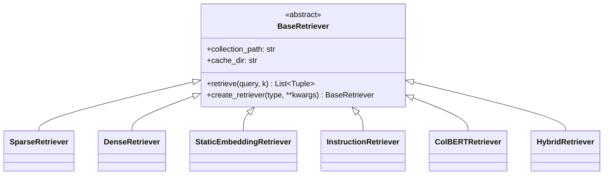

import RetrieverComparison from '@site/src/components/RetrieverComparison';

# Retrieval Module Overview

## What Is Information Retrieval?

**Information retrieval (IR)** is the process of finding relevant documents from a large collection in response to a user's query. In the context of a Retrieval-Augmented Generation (RAG) system like RAG42, retrieval is the critical first step — before the system can *generate* an answer, it must first *find* the right passages to use as evidence.

Think of it like searching for a book in a library. You could:

- **Scan every title on every shelf** (brute force) — accurate but extremely slow.
- **Use the library catalog** (keyword index) — fast, but only works if you use the exact right words.
- **Ask a librarian who understands meaning** (semantic search) — finds books even if the wording differs.

RAG42 implements all three strategies, plus combinations of them, so you can choose the best approach for your use case.

:::info HotpotQA Dataset
RAG42 is built around the **HotpotQA** benchmark, a multi-hop question answering dataset. Multi-hop questions require reasoning over *multiple* documents to arrive at an answer — making high-quality retrieval especially important.
:::

## Why Retrieval Matters for RAG

A RAG pipeline has two major stages:


If retrieval fails — if the right documents are not in the retrieved set — then no amount of clever generation can produce a correct answer. **Retrieval quality is the bottleneck.**

Common failure modes include:

- **Missing evidence**: The relevant document was not retrieved at all.
- **Irrelevant noise**: Too many unrelated documents drown out the useful ones.
- **Partial coverage**: Only one of the required evidence documents is retrieved (problematic for multi-hop questions).

## Sparse vs. Dense Retrieval

The two fundamental retrieval paradigms are **sparse** and **dense**:

| Aspect | Sparse Retrieval | Dense Retrieval |
|---|---|---|
| **Representation** | Bag-of-words / term frequencies | Neural network embeddings (vectors) |
| **Matching** | Exact term overlap (lexical) | Semantic similarity (meaning) |
| **Handles synonyms?** | No — "car" and "automobile" are different | Yes — they map to similar vectors |
| **Speed** | Very fast (inverted index) | Fast with FAISS, but requires encoding |
| **Interpretability** | High — you can see which terms matched | Low — vectors are hard to interpret |
| **Out-of-vocabulary** | Handles new/rare terms naturally | Struggles with terms unseen during training |
| **Typical models** | BM25, TF-IDF | BERT, BGE, E5, ColBERT |

:::tip Neither Is Always Better
Research consistently shows that **combining sparse and dense** retrieval outperforms either one alone. That is exactly what RAG42's `HybridRetriever` does.
:::

## Retriever Types in RAG42

RAG42 provides **six retriever implementations**, each with different trade-offs:

| Retriever | Type | Description |
|---|---|---|
| **SparseRetriever** | Sparse | BM25-based keyword matching using the `bm25s` library |
| **DenseRetriever** | Dense | BGE embeddings (1024-dim) with FAISS nearest-neighbor search |
| **StaticEmbeddingRetriever** | Dense | Lightweight Word2Vec average-pooling baseline using gensim |
| **InstructionRetriever** | Dense | E5-instruct model with task-specific instruction prefixes |
| **ColBERTRetriever** | Dense (multi-vector) | Token-level embeddings with late interaction (MaxSim scoring) |
| **HybridRetriever** | Hybrid | Combines BM25 + BGE via Reciprocal Rank Fusion, with optional cross-encoder re-ranking |

## Factory Pattern

All retrievers inherit from `BaseRetriever` and can be instantiated through a **factory method** — a single function call that creates any retriever type by name:

```python
from retriever_base import BaseRetriever

# Create any retriever with a single call
retriever = BaseRetriever.create_retriever(
    "hybrid",
    collection_path="RUC-TMD/hotpotqa-passage-300",
    use_cache=True
)

# Use the retriever
results = retriever.retrieve("What is the capital of France?", k=20)
```

The factory supports these type strings: `"sparse"`, `"static_embedding"`, `"dense"`, `"instruction"`, `"colbert"`, and `"hybrid"`.



:::note BaseRetriever Interface
Every retriever implements the same `retrieve(query: str, k: int = 20) -> List[Tuple[str, str, float]]` method, returning a list of `(doc_id, doc_text, score)` tuples sorted by relevance. This uniform interface makes it easy to swap retrievers or combine them.
:::

## Interactive Comparison

Use the component below to interactively compare the different retriever approaches:

<RetrieverComparison />

## Next Steps

Explore each retriever type in detail:

- [Sparse Retrieval (BM25)](./sparse) — keyword-based matching
- [Dense Retrieval (BGE)](./dense) — semantic embeddings
- [Static Embeddings (Word2Vec)](./static-embedding) — lightweight baseline
- [Instruction-based Retrieval (E5)](./instruction) — task-aware embeddings
- [Multi-vector Retrieval (ColBERT)](./colbert) — token-level interaction
- [Hybrid Retrieval with RRF](./hybrid) — combining the best of both worlds
- [Cross-Encoder Re-ranking](./reranker) — improving precision after retrieval
