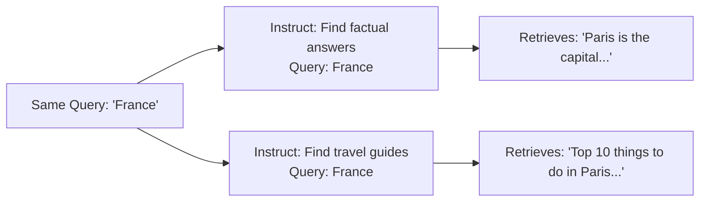

# Instruction-based Retrieval (E5)

## What Are Instruction-Tuned Embeddings?

Standard embedding models like BGE are trained to produce good embeddings for general retrieval tasks. But different tasks have different notions of "relevance":

- **Factoid QA**: "What year was Python created?" → wants a document with the number "1991"
- **Summarization**: "Summarize the causes of WWI" → wants a comprehensive document
- **Classification**: "Is this review positive?" → wants a document with sentiment cues

**Instruction-tuned embedding models** are trained to accept a *natural language instruction* that tells the model what kind of relevance to optimize for. The same query, paired with different instructions, produces different embeddings — and therefore retrieves different documents.

:::info E5 Models
The E5 family (from Microsoft Research) stands for "EmbEddings from bidirEctional Encoder rEpresentations." The instruction-tuned variants are trained on a diverse mixture of retrieval tasks with task descriptions, enabling zero-shot generalization to new tasks.
:::

## The Instruction Format

E5-instruct models expect queries to be formatted with a special two-part template:

```
Instruct: <task instruction>
Query: <actual query>
```

For example:

```
Instruct: Given a question, retrieve relevant documents that answer the question.
Query: What is the capital of France?
```

This instruction tells the model: "When you encode this query, optimize for finding documents that *answer* the question — not documents that merely *discuss* the topic."



## Why Instructions Matter

Without instructions, the model uses a generic notion of similarity. With instructions, you can steer the model toward exactly the kind of documents you need.

| Instruction | Query | Retrieves |
|---|---|---|
| "Given a question, retrieve relevant documents that answer the question." | "Who invented the telephone?" | Documents containing "Alexander Graham Bell" |
| "Retrieve documents that are semantically similar to the given passage." | "The telephone was patented in 1876." | Documents about telephone history |
| "Given a claim, retrieve documents that support or refute the claim." | "Edison invented the telephone." | Documents about telephone invention disputes |

:::tip For RAG42
The default instruction is `"Given a question, retrieve relevant documents that answer the question."` — well-suited for HotpotQA's question-answering task. You can customize this for other use cases.
:::

## How It Differs from Standard Dense Retrieval

The key difference from `DenseRetriever` (BGE) is the instruction prefix:

| Aspect | DenseRetriever (BGE) | InstructionRetriever (E5) |
|---|---|---|
| **Query prefix** | `"Represent this sentence: "` | `"Instruct: <task>\nQuery: "` |
| **Document prefix** | None | None |
| **Model** | BGE-large (326M params) | E5-mistral-7b (7B params) |
| **Task awareness** | Generic similarity | Task-specific similarity |
| **Model size** | ~1.3 GB | ~14 GB |

Notice that documents are encoded **without** any prefix — only queries receive the instruction.

## Full Implementation

Here is the complete `InstructionRetriever` from RAG42:

```python
# instruction_retriever.py

import faiss
from sentence_transformers import SentenceTransformer
import numpy as np
from retriever_base import BaseRetriever

class InstructionRetriever(BaseRetriever):
    def __init__(
        self,
        collection_path: str,
        dense_model_name: str = "intfloat/multilingual-e5-large-instruct",
        use_cache: bool = True,
        cache_dir: str = "./cache",
        query_instruction: str = (
            "Given a question, retrieve relevant documents "
            "that answer the question."
        )
    ):
        self.dense_model_name = dense_model_name
        self.use_cache = use_cache
        self.query_instruction = query_instruction
        super().__init__(collection_path, cache_dir)
        self._build_index()

    def _get_detailed_instruct(self, instruction, query):
        """Formats query with instruction prefix for E5-instruct models."""
        return f"Instruct: {instruction}\nQuery: {query}"

    def _build_index(self):
        """Builds the FAISS index with instruction-based embeddings."""
        cache_path = os.path.join(
            self.cache_dir,
            f"faiss_index_{self.dense_model_name.replace('/', '_')}_instruct.faiss"
        )

        if self.use_cache and os.path.exists(cache_path):
            self.dense_model = SentenceTransformer(self.dense_model_name)
            self.dense_index = faiss.read_index(cache_path)
            return

        self.dense_model = SentenceTransformer(self.dense_model_name)

        # Encode documents WITHOUT instruction prefix
        doc_embeddings = self.dense_model.encode(
            self.doc_texts, batch_size=32, show_progress_bar=True
        )

        # Build FAISS index
        dimension = doc_embeddings.shape[1]
        self.dense_index = faiss.IndexFlatIP(dimension)
        faiss.normalize_L2(doc_embeddings)
        self.dense_index.add(doc_embeddings.astype(np.float32))

        if self.use_cache:
            faiss.write_index(self.dense_index, cache_path)

    def retrieve(self, query: str, k: int = 20):
        """Retrieves top-k documents using instruction-based embeddings."""
        # Format query with instruction prefix
        instruct_query = self._get_detailed_instruct(
            self.query_instruction, query
        )
        query_emb = self.dense_model.encode([instruct_query])
        faiss.normalize_L2(query_emb)
        scores, indices = self.dense_index.search(
            query_emb.astype(np.float32), k=k
        )

        results = []
        for i in range(len(indices[0])):
            doc_idx = int(indices[0][i])
            results.append((
                self.doc_ids[doc_idx],
                self.doc_texts[doc_idx],
                float(scores[0][i])
            ))
        return results
```

### Key Implementation Details

1. **Asymmetric encoding**: Queries get the instruction prefix; documents do not. This is by design — E5 models are trained with this asymmetry.
2. **Instruction customization**: The `query_instruction` parameter lets you adapt the retriever to different tasks without retraining.
3. **FAISS index**: Identical infrastructure to `DenseRetriever` — uses `IndexFlatIP` with L2-normalized embeddings.
4. **Float32 casting**: E5 models sometimes output float16; the explicit `.astype(np.float32)` ensures FAISS compatibility.

:::warning Large Model
The default `intfloat/multilingual-e5-large-instruct` model is significantly larger than BGE. If memory is a concern, consider using `intfloat/e5-small-v2` (33M params) for experiments, though quality will be lower.
:::

## Available E5 Models

| Model | Params | Dims | Quality | Speed |
|---|---|---|---|---|
| `intfloat/e5-small-v2` | 33M | 384 | Good | Very fast |
| `intfloat/e5-base-v2` | 109M | 768 | Better | Fast |
| `intfloat/e5-large-v2` | 335M | 1024 | Great | Moderate |
| `intfloat/multilingual-e5-large-instruct` | 560M | 1024 | Excellent | Slower |
| `intfloat/e5-mistral-7b-instruct` | 7B | 4096 | Best | Slow |

:::tip Choosing a Model
For HotpotQA experiments, `multilingual-e5-large-instruct` offers a good balance. If you need maximum quality and have GPU memory to spare, try `e5-mistral-7b-instruct` — but expect slower encoding and much higher memory usage.
:::
