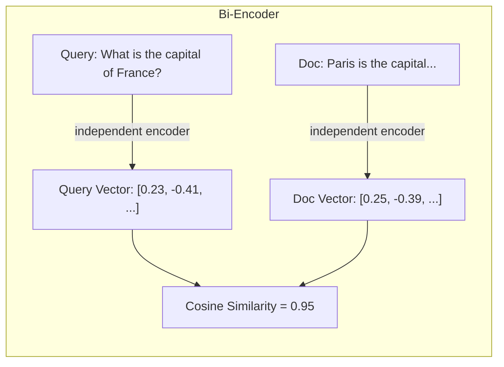
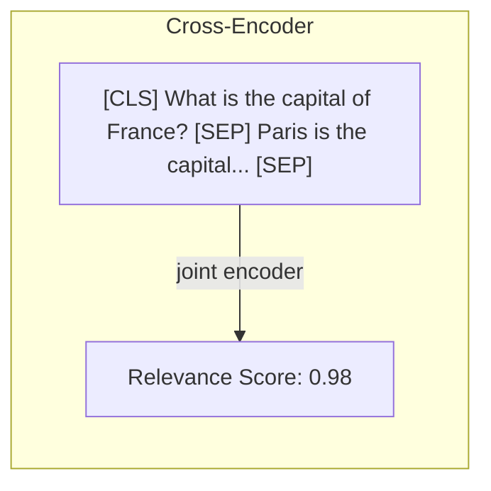
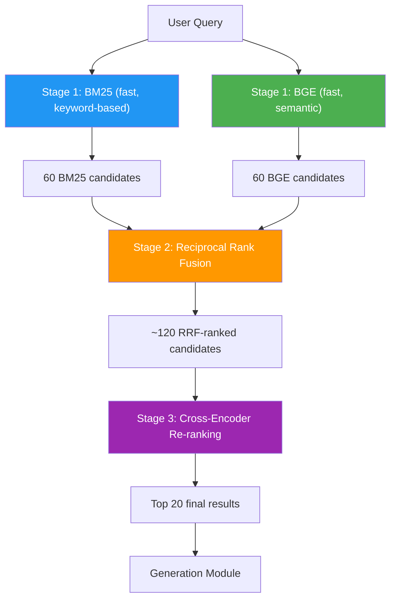

# Cross-Encoder Re-ranking

## What Is Re-ranking?

Re-ranking is a **second pass** over already-retrieved documents. The first retriever (BM25, BGE, or hybrid) casts a wide net to find *possibly* relevant documents. The re-ranker then carefully re-scores those candidates to promote the truly relevant ones to the top.

Think of it like a job application process:
1. **First pass (retrieval)**: HR screens 500 resumes quickly, selects 30 candidates.
2. **Second pass (re-ranking)**: The hiring manager reads those 30 resumes carefully and picks the best 5.

## Bi-Encoder vs. Cross-Encoder

The fundamental difference is *when* the query and document interact:

### Bi-Encoder (Used for Retrieval)

The query and document are encoded **independently** into separate vectors. Similarity is computed *after* encoding.



**Key property**: Documents can be encoded *once* and reused for all queries. This makes bi-encoders very fast at query time.

### Cross-Encoder (Used for Re-ranking)

The query and document are fed **together** into a single model. Every token can attend to every other token, capturing deep interactions.



**Key property**: The model sees the full interaction between query and document tokens. This produces much more accurate relevance scores — but you must run the model *separately for each query-document pair*.

:::warning Cannot Precompute
Because the cross-encoder must see the query and document together, you cannot precompute document embeddings. Every new query requires re-scoring all candidate documents from scratch. This is why cross-encoders are used as *re-rankers* on a small candidate set, not as primary retrievers.
:::

## Why Cross-Encoders Are More Accurate

In a bi-encoder, the query "What is the capital of France?" is compressed into a single 1024-dimensional vector *before* it ever sees a document. This compression inevitably loses information.

A cross-encoder can attend to fine-grained interactions:

| Interaction | Bi-Encoder | Cross-Encoder |
|---|---|---|
| "capital" in query ↔ "capital" in doc | Captured (approximately) | Captured (exactly) |
| "France" in query ↔ "Paris" in doc | Captured (approximately) | Captured (exactly, through attention) |
| "What is the" ↔ "the capital of" | Lost in compression | Captured (full attention) |
| Query structure ↔ Document structure | Lost | Captured |

## BAAI/bge-reranker-v2-m3

RAG42 uses **BAAI/bge-reranker-v2-m3** as the default cross-encoder re-ranker. This model:

| Property | Value |
|---|---|
| **Base architecture** | XLM-RoBERTa-large |
| **Parameters** | ~568 million |
| **Max sequence length** | 512 tokens |
| **Languages** | Multilingual (100+ languages) |
| **Training** | Fine-tuned on retrieval data with contrastive learning |

The model takes a (query, document) pair as input and outputs a single relevance score.

## Tradeoffs

| Aspect | Bi-Encoder (Retrieval) | Cross-Encoder (Re-ranking) |
|---|---|---|
| **Accuracy** | Good | Excellent |
| **Speed** | Very fast (precomputed) | Slow (must run per pair) |
| **Scalability** | Works with millions of docs | Only practical for hundreds of candidates |
| **Use case** | First-stage retrieval | Second-stage re-ranking |
| **Precomputable** | Yes | No |
| **Input** | Query or document alone | Query + document together |

:::info Practical Numbers
For the HotpotQA collection (~5M documents):
- **Bi-encoder retrieval**: ~50ms per query (FAISS search over precomputed embeddings)
- **Cross-encoder re-ranking 60 candidates**: ~2-5 seconds per query (60 forward passes through the model)

This is why the cross-encoder only re-ranks the top candidates from the first stage, not the entire collection.
:::

## Full Implementation

Here is the complete `CrossEncoderReranker` from RAG42:

```python
# reranker.py

from typing import List, Tuple
from sentence_transformers import CrossEncoder

class CrossEncoderReranker:
    def __init__(
        self,
        model_name: str = "BAAI/bge-reranker-v2-m3",
        max_length: int = 512
    ):
        """
        Initializes the Cross-Encoder Re-ranker.

        Args:
            model_name: Name of the cross-encoder model.
            max_length: Maximum sequence length for the cross-encoder.
        """
        self.model_name = model_name
        self.max_length = max_length
        self.model = CrossEncoder(model_name, max_length=max_length)

    def rerank(
        self,
        query: str,
        documents: List[Tuple[str, str, float]],
        top_k: int = 10
    ) -> List[Tuple[str, str, float]]:
        """
        Re-ranks documents using the cross-encoder.

        Args:
            query: The query string.
            documents: List of (doc_id, doc_text, original_score) tuples.
            top_k: Number of documents to return after re-ranking.

        Returns:
            List of (doc_id, doc_text, reranker_score) tuples,
            sorted by score descending.
        """
        if not documents:
            return []

        # Build (query, document) pairs for scoring
        pairs = [(query, doc_text) for _, doc_text, _ in documents]

        # Score all pairs with the cross-encoder
        scores = self.model.predict(pairs, show_progress_bar=False)

        # Build results sorted by cross-encoder score
        results = []
        for i, (doc_id, doc_text, _) in enumerate(documents):
            results.append((doc_id, doc_text, float(scores[i])))

        results.sort(key=lambda x: x[2], reverse=True)
        return results[:top_k]
```

### Key Implementation Details

1. **Input format**: The `documents` parameter accepts the same `(doc_id, doc_text, score)` tuples that retrievers produce, making it easy to pipe retrieval results directly into the reranker.
2. **Original scores discarded**: The reranker computes entirely new scores — the original retrieval scores are ignored (replaced by `_` in the unpacking).
3. **Batch prediction**: `CrossEncoder.predict()` processes all pairs in a single call, which is more efficient than scoring one pair at a time.
4. **Flexible top_k**: The `top_k` parameter lets you control how many documents survive the re-ranking step.

:::warning Max Sequence Length
The default `max_length=512` means that long documents will be **truncated**. For HotpotQA's 300-word passages, this is usually sufficient. If your documents are longer, consider chunking them before retrieval.
:::

## When to Use Re-ranking

### Use Re-ranking When:

- You need **high precision** — the top results must be highly relevant
- You are using a **multi-hop QA** pipeline where irrelevant documents waste the generator's context window
- Your first-stage retriever returns enough candidates (30-100) for the reranker to select from
- Latency of 2-5 seconds per query is acceptable

### Skip Re-ranking When:

- You need **sub-second response times**
- Your first-stage retrieval is already precise enough
- You are processing a very high volume of queries where per-query cost matters
- GPU resources are limited (cross-encoders benefit significantly from GPU acceleration)

:::tip Integration with HybridRetriever
The `CrossEncoderReranker` is automatically used by `HybridRetriever` when `use_reranker=True`. In that pipeline, it re-ranks the top `k*3` RRF candidates and returns the top `k` final results. This is the highest-quality configuration in RAG42.
:::

## Summary: The Full Pipeline

Putting it all together, RAG42's best retrieval pipeline works like this:



This three-stage pipeline — **retrieve broadly**, **fuse rankings**, **re-rank precisely** — represents the current state of the art in retrieval for RAG systems.
