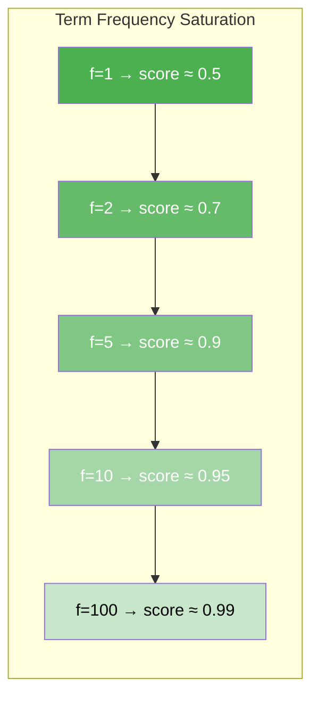

# Sparse Retrieval (BM25)

## From TF-IDF to BM25

Before understanding BM25, it helps to know its predecessor: **TF-IDF** (Term Frequency -- Inverse Document Frequency).

**TF-IDF** scores a document for a query by combining two intuitions:

1. **Term Frequency (TF)**: A document that contains a query word *many times* is probably more relevant.
2. **Inverse Document Frequency (IDF)**: A word that appears in *few* documents is more informative than a common word like "the".

BM25 (Best Matching 25) is an evolution of TF-IDF that adds **term frequency saturation** and **document length normalization**. It was introduced by Robertson et al. in 1995 and remains one of the most effective retrieval algorithms — often surprisingly hard to beat even with modern neural methods.

:::info Why "BM25"?
The "25" refers to the year-long series of experiments at TREC (Text REtrieval Conference) that led to this particular formula — it was the 25th iteration of the Okapi BM scoring system.
:::

## The BM25 Formula

For a query $Q$ containing terms $q_1, q_2, \ldots, q_n$, the BM25 score of a document $D$ is:

`BM25(D, Q) = SUM_i IDF(q_i) * (f(q_i, D) * (k1 + 1)) / (f(q_i, D) + k1 * (1 - b + b * |D| / avgdl))`

Let us break this down term by term:

| Component | Formula | Meaning |
|---|---|---|
| $f(q_i, D)$ | raw count | How many times term $q_i$ appears in document $D$ |
| $\|D\|$ | length | The number of terms in document $D$ |
| avgdl | average | The average document length in the entire collection |
| $k_1$ | parameter (default ~1.2--2.0) | Controls term frequency saturation |
| $b$ | parameter (default ~0.75) | Controls document length normalization |
| `IDF(q_i)` | `ln((N - n(q_i) + 0.5) / (n(q_i) + 0.5)) + 1` | Inverse document frequency of term `q_i` |

Where $N$ is the total number of documents and $n(q_i)$ is the number of documents containing term $q_i$.

## Term Frequency Saturation

One of BM25's key improvements over raw TF-IDF is **saturation**. In basic TF-IDF, if a term appears 100 times in a document, it gets 10x the score of a document where it appears 10 times. BM25 says: after a certain point, more occurrences do not help much.

The parameter **k1** controls this:

- **k1 = 0**: Term frequency is completely ignored. Only IDF matters.
- **k1 = 1.2** (typical default): Moderate saturation. The first few occurrences of a term matter most; additional occurrences have diminishing returns.
- **k1 = large**: Approaches raw TF-IDF behavior (no saturation).



:::tip Intuition
Think of it like reading a resume. Seeing "Python" mentioned once tells you the person knows Python. Seeing it mentioned 50 times does not make them 50x better — it might just mean they wrote a longer resume.
:::

## Document Length Normalization

The parameter **b** controls how much to penalize longer documents:

- **b = 0**: No length normalization. A long document is treated the same as a short one.
- **b = 0.75** (typical default): Moderate normalization. Longer documents are penalized because they have more opportunities to accidentally contain query terms.
- **b = 1**: Full normalization. Scores are scaled strictly by the ratio of document length to average document length.

Without normalization, long documents would have an unfair advantage simply because they contain more words.

## How RAG42 Implements BM25

RAG42's `SparseRetriever` uses the [`bm25s`](https://github.com/xhluca/bm25s) library, a fast, sparse-friendly BM25 implementation.

```python
# sparse_retriever.py

import bm25s
from retriever_base import BaseRetriever

class SparseRetriever(BaseRetriever):
    def __init__(
        self,
        collection_path: str,
        sparse_model_name: str = "bm25s",
        use_cache: bool = True,
        cache_dir: str = "./cache",
        skip_load: bool = False
    ):
        self.sparse_model_name = sparse_model_name
        self.use_cache = use_cache
        super().__init__(collection_path, cache_dir, skip_load=skip_load)
        if not skip_load:
            self._build_index()

    def _build_index(self):
        """Builds the BM25 index, loading from cache if available."""
        cache_path = os.path.join(
            self.cache_dir,
            f"bm25_index_{self.sparse_model_name.replace('/', '_')}.npz"
        )

        if self.use_cache and os.path.exists(cache_path):
            # Load pre-built index from disk
            self.bm25_retriever = bm25s.BM25.load(cache_path, load_corpus=False)
            return

        # Tokenize corpus (removing English stopwords)
        corpus_tokens = bm25s.tokenize(self.doc_texts, stopwords="en")

        # Build the BM25 index
        self.bm25_retriever = bm25s.BM25()
        self.bm25_retriever.index(corpus_tokens)

        # Cache the index for future runs
        if self.use_cache:
            self.bm25_retriever.save(cache_path)

    def retrieve(self, query: str, k: int = 20):
        """Retrieves top-k documents using BM25."""
        query_tokens = bm25s.tokenize([query], stopwords="en")
        scores, indices = self.bm25_retriever.retrieve(query_tokens, k=k)

        results = []
        for i in range(len(indices[0])):
            doc_idx = int(indices[0][i])
            doc_id = self.doc_ids[doc_idx]
            doc_text = self.doc_texts[doc_idx]
            score = float(scores[0][i])
            results.append((doc_id, doc_text, score))

        return results
```

### Key Implementation Details

1. **Tokenization**: Documents are tokenized with English stopwords removed using `bm25s.tokenize()`.
2. **Caching**: Once the BM25 index is built, it is saved to disk as a `.npz` file. Subsequent loads skip the expensive tokenization and indexing step.
3. **Scoring**: The `bm25s` library returns both scores and document indices in a single efficient call.

:::warning No Stemming
The RAG42 implementation does **not** apply stemming. This means "running" and "run" are treated as different terms. This is a deliberate trade-off — stemming can sometimes hurt precision for named entities and proper nouns common in HotpotQA.
:::

## Advantages and Disadvantages

### When to Use BM25

| Advantage | Explanation |
|---|---|
| **No model download** | BM25 requires no neural network — it works immediately |
| **Fast indexing** | Building the index is much faster than encoding with a transformer |
| **Exact term matching** | Excellent when queries contain specific names, dates, or numbers |
| **Interpretable** | You can see exactly which query terms matched which document terms |
| **Robust baseline** | Surprisingly competitive with dense retrieval on many benchmarks |

### When NOT to Use BM25

| Disadvantage | Explanation |
|---|---|
| **No semantic understanding** | "What is the capital of France?" will not match "Paris is a city in Europe" well |
| **Vocabulary mismatch** | Synonyms, paraphrases, and abbreviations are missed |
| **Multi-hop reasoning** | Hard to retrieve bridging documents that share no keywords with the query |
| **Long queries** | Performance degrades with very long or verbose queries |

:::tip Best Practice
BM25 is an excellent *first retriever* to try. It sets a strong baseline and helps you understand whether your system's problems are in retrieval or generation. If BM25 alone gives poor recall, the issue may be in the data or the questions themselves.
:::
