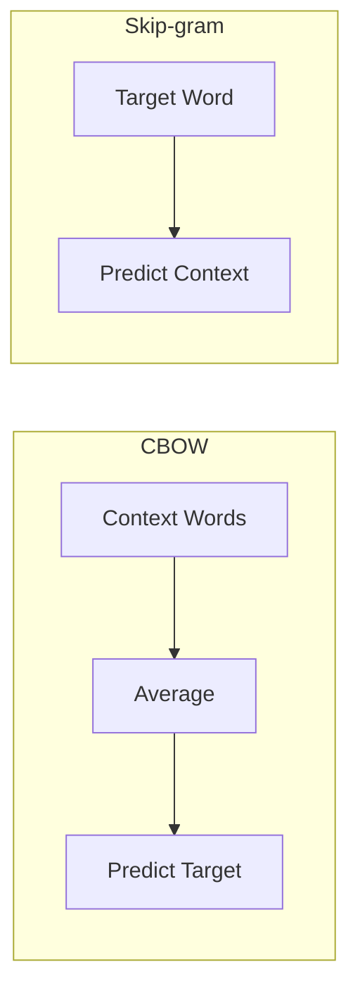
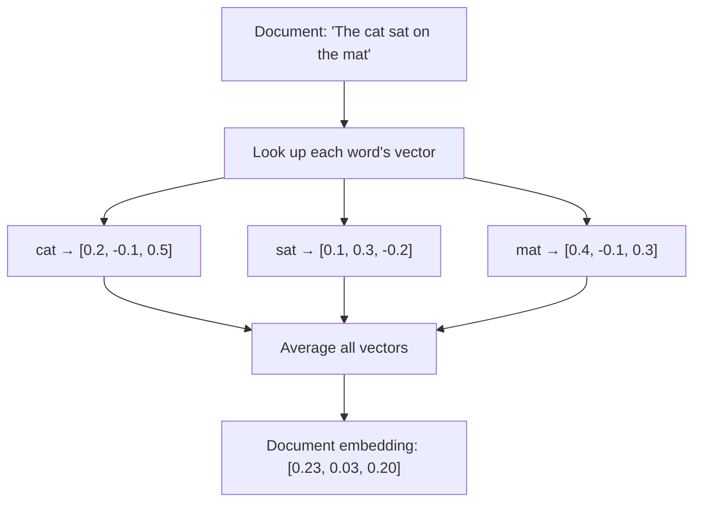

# Static Embeddings (Word2Vec)

## What Are Static Embeddings?

Unlike transformer-based models that produce *context-dependent* embeddings (the word "bank" gets different vectors in "river bank" vs. "bank account"), **static embeddings** assign a single, fixed vector to each word regardless of context. The most famous static embedding method is **Word2Vec**, introduced by Google in 2013.

Think of it as a dictionary: every word has one entry, and that entry is a vector of numbers.

| Word | Embedding (simplified) |
|---|---|
| king | `[0.8, 0.3, -0.1]` |
| queen | `[0.7, 0.4, -0.1]` |
| banana | `[-0.5, -0.2, 0.9]` |

These vectors are learned so that words appearing in similar contexts get similar vectors — a property called the **distributional hypothesis**: "a word is characterized by the company it keeps."

## Word2Vec Architecture

Word2Vec comes in two flavors:

### CBOW (Continuous Bag of Words)

Predicts a target word from its surrounding context words.

```
Context: ["The", "cat", "on", "the", "___", "jumped"]
Target:  "mat"
```

### Skip-gram

Predicts context words from a target word.

```
Target:   "cat"
Context:  ["The", "___", "on", "the", "mat", "jumped"]
```



:::info Which Is Better?
**Skip-gram** generally works better for rare words and smaller datasets. **CBOW** is faster to train and works well for frequent words. RAG42 uses gensim's default, which is CBOW (sg=0).
:::

## Training with Gensim

RAG42 trains Word2Vec directly on the HotpotQA document collection using the `gensim` library. This means the model learns the vocabulary and word relationships specific to the Wikipedia-based HotpotQA data.

```python
from gensim.models import Word2Vec
from gensim.utils import simple_preprocess

# Tokenize all documents
tokenized_docs = [simple_preprocess(text, deacc=True) for text in doc_texts]

# Train Word2Vec
model = Word2Vec(
    sentences=tokenized_docs,
    vector_size=100,   # Embedding dimensions
    window=5,          # Context window size
    min_count=1,       # Include all words (even rare ones)
    workers=4          # Parallel threads
)
```

| Parameter | Default | Meaning |
|---|---|---|
| `vector_size` | 100 | Dimensionality of the word vectors |
| `window` | 5 | How many surrounding words to consider as context |
| `min_count` | 1 | Minimum word frequency to be included in vocabulary |
| `workers` | 4 | Number of CPU threads for parallel training |

## Average Pooling for Document Embeddings

Word2Vec gives us a vector per *word*, but we need a vector per *document*. The simplest approach is **average pooling**: take the mean of all word vectors in a document.



```python
import numpy as np

def _get_document_embedding(self, text):
    """Computes a document embedding by averaging word vectors."""
    tokens = simple_preprocess(text, deacc=True)
    embeddings = []

    for token in tokens:
        if token in self.word2vec_model.wv:
            embeddings.append(self.word2vec_model.wv[token])

    if embeddings:
        return np.mean(embeddings, axis=0)
    else:
        return np.zeros(self.embedding_dim)  # Zero vector if no known words
```

:::warning Limitation of Average Pooling
Average pooling treats all words equally — "the" contributes as much as "Einstein." More sophisticated methods like TF-IDF weighted averaging can help, but RAG42 keeps it simple for this baseline.
:::

## Full Implementation

Here is the complete `StaticEmbeddingRetriever` from RAG42:

```python
# static_embedding_retriever.py

import numpy as np
from gensim.models import Word2Vec
from gensim.utils import simple_preprocess
from retriever_base import BaseRetriever

class StaticEmbeddingRetriever(BaseRetriever):
    def __init__(
        self,
        collection_path: str,
        embedding_dim: int = 100,
        window: int = 5,
        min_count: int = 1,
        workers: int = 4,
        use_cache: bool = True,
        cache_dir: str = "./cache"
    ):
        self.embedding_dim = embedding_dim
        self.window = window
        self.min_count = min_count
        self.workers = workers
        self.use_cache = use_cache
        super().__init__(collection_path, cache_dir)
        self._build_index()

    def _build_index(self):
        """Builds or loads the Word2Vec model."""
        cache_path = os.path.join(
            self.cache_dir,
            f"word2vec_model_{self.embedding_dim}d.model"
        )

        if self.use_cache and os.path.exists(cache_path):
            self.word2vec_model = Word2Vec.load(cache_path)
        else:
            # Tokenize and train
            tokenized_docs = [
                simple_preprocess(text, deacc=True)
                for text in self.doc_texts
            ]
            self.word2vec_model = Word2Vec(
                sentences=tokenized_docs,
                vector_size=self.embedding_dim,
                window=self.window,
                min_count=self.min_count,
                workers=self.workers
            )
            if self.use_cache:
                self.word2vec_model.save(cache_path)

        # Precompute document embeddings
        self._compute_document_embeddings()

    def _compute_document_embeddings(self):
        """Computes document embeddings as average of word embeddings."""
        self.doc_embeddings = []
        for text in self.doc_texts:
            tokens = simple_preprocess(text, deacc=True)
            embeddings = [
                self.word2vec_model.wv[t]
                for t in tokens if t in self.word2vec_model.wv
            ]
            if embeddings:
                self.doc_embeddings.append(np.mean(embeddings, axis=0))
            else:
                self.doc_embeddings.append(np.zeros(self.embedding_dim))
        self.doc_embeddings = np.array(self.doc_embeddings)

    def retrieve(self, query: str, k: int = 20):
        """Retrieves top-k documents using cosine similarity."""
        # Compute query embedding
        tokens = simple_preprocess(query, deacc=True)
        embeddings = [
            self.word2vec_model.wv[t]
            for t in tokens if t in self.word2vec_model.wv
        ]
        if embeddings:
            query_embedding = np.mean(embeddings, axis=0)
        else:
            query_embedding = np.zeros(self.embedding_dim)

        # Normalize for cosine similarity
        query_norm = query_embedding / (
            np.linalg.norm(query_embedding) + 1e-10
        )
        doc_norms = self.doc_embeddings / (
            np.linalg.norm(self.doc_embeddings, axis=1, keepdims=True) + 1e-10
        )

        # Compute similarities and get top-k
        similarities = np.dot(doc_norms, query_norm)
        top_indices = np.argsort(similarities)[::-1][:k]

        results = []
        for idx in top_indices:
            results.append((
                self.doc_ids[idx],
                self.doc_texts[idx],
                float(similarities[idx])
            ))
        return results
```

### Key Implementation Details

1. **Trained on corpus**: Unlike pre-trained transformers, Word2Vec is trained directly on the HotpotQA collection, so it learns domain-specific word relationships.
2. **Precomputed embeddings**: All document embeddings are computed once during initialization and stored as a NumPy array for fast retrieval.
3. **Cosine similarity**: Retrieval uses normalized dot product (cosine similarity) computed via NumPy — no FAISS needed since the embedding space is simple enough.
4. **Zero-vector fallback**: Documents with no recognized words get a zero vector, which will have similarity 0 with any query.

## When to Use as a Baseline

`StaticEmbeddingRetriever` is primarily useful as a **lightweight baseline**:

| Use Case | Why Word2Vec? |
|---|---|
| **Quick experiments** | No large model download; trains in seconds |
| **Baseline comparison** | Establishes a floor for what "simple" retrieval achieves |
| **Resource-constrained** | Runs entirely on CPU with minimal memory |
| **Understanding the gap** | Shows how much transformers improve over static embeddings |

:::tip Baseline Strategy
Start with `StaticEmbeddingRetriever` to verify your pipeline works end-to-end, then upgrade to `DenseRetriever` or `HybridRetriever` for production-quality results. The performance gap between Word2Vec and BGE will be significant — that gap is what justifies the computational cost of transformer models.
:::

:::info Typical Performance
On HotpotQA, Word2Vec average pooling typically achieves significantly lower recall@20 than BM25 or BGE. It is not recommended as a production retriever — its value is educational and as a fast sanity check.
:::
