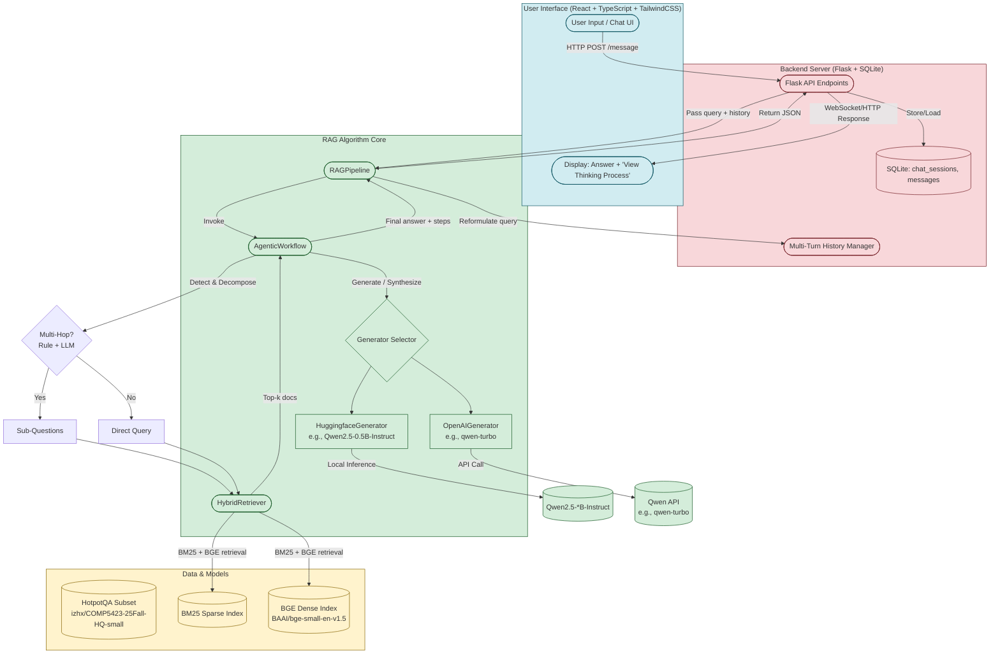

```mermaid
graph TD

    %% Frontend Layer
    subgraph Frontend["User Interface (React + TypeScript + TailwindCSS)"]
        UI([User Input / Chat UI])
        Display([Display: Answer + 'View Thinking Process'])
    end


        %% Backend Layer
    subgraph Backend["Backend Server (Flask + SQLite)"]
        API([Flask API Endpoints])
        DB[(SQLite: chat_sessions, messages)]
        History([Multi-Turn History Manager])
    end

        %% RAG Core Layer
    subgraph RAG["RAG Algorithm Core"]
        Pipeline([RAGPipeline])
        Workflow([AgenticWorkflow])
        Retriever([HybridRetriever])
        Generator{Generator Selector}
        HFG[HuggingfaceGenerator<br/>e.g., Qwen2.5-0.5B-Instruct]
        OAI[OpenAIGenerator<br/>e.g., qwen-turbo]
    end

    
    %% Data Sources
    subgraph Data["Data & Models"]
        HotpotQA[(HotpotQA Subset<br/>izhx/COMP5423-25Fall-HQ-small)]
        BM25_Index[(BM25 Sparse Index)]
        BGE_Index[(BGE Dense Index<br/>BAAI/bge-small-en-v1.5)]
    end

    

    %% Connections
    UI -->|HTTP POST /message| API
    API -->|Store/Load| DB
    API -->|Pass query + history| Pipeline
    Pipeline -->|Reformulate query| History
    Pipeline -->|Invoke| Workflow
    Workflow -->|Detect & Decompose| MultiHopLogic{Multi-Hop?<br/>Rule + LLM}
    MultiHopLogic -->|Yes| SubQ[Sub-Questions]
    MultiHopLogic -->|No| DirectQ[Direct Query]
    SubQ --> Retriever
    DirectQ --> Retriever
    Retriever -->|BM25 + BGE retrieval| BM25_Index
    Retriever -->|BM25 + BGE retrieval| BGE_Index
    Retriever -->|Top-k docs| Workflow
    Workflow -->|Generate / Synthesize| Generator
    Generator --> HFG
    Generator --> OAI
    HFG -->|Local Inference| QwenModel[(Qwen2.5-*B-Instruct)]
    OAI -->|API Call| QwenAPI[(Qwen API<br/>e.g., qwen-turbo)]
    Workflow -->|Final answer + steps| Pipeline
    Pipeline -->|Return JSON| API
    API -->|WebSocket/HTTP Response| Display

    %% Styling
    classDef frontend fill:#d1ecf1,stroke:#0c5460
    classDef backend fill:#f8d7da,stroke:#721c24
    classDef rag fill:#d4edda,stroke:#155724
    classDef data fill:#fff3cd,stroke:#856404

    class UI,Display,Frontend frontend
    class API,DB,History,Backend backend
    class Pipeline,Workflow,Retriever,Generator,HFG,OAI,QwenModel,QwenAPI,RAG rag
    class HotpotQA,BM25_Index,BGE_Index,Data data
```